# LLM Intuition: A Detailed Student Tutorial

This document is a readable learning tutorial about how GPT-style language models work.

It is intentionally not a transcript and not a literal slide-by-slide description. The goal is to provide a study document you can work through as a student: first the mental model, then the math, then the transformer architecture, then training, inference, and systems performance.

## Markdown Rendering Notes

This document uses two Markdown features that are worth knowing about:

- Mermaid diagrams in fenced code blocks such as ```` ```mermaid ````.
- LaTeX-style math using inline `$...$` and block `$$...$$` syntax.

VS Code's built-in Markdown preview renders both: Mermaid diagrams are rendered from `mermaid` fenced code blocks, and math is rendered with KaTeX. That makes Mermaid a good choice here because the diagrams remain editable text, version-control friendly, and readable even when not rendered. For formulas, LaTeX math is better than ASCII because the equations render clearly in preview while still staying close to the notation you see in papers and model code.

The tradeoff is portability. Some Markdown renderers support both Mermaid and math; some support only one; some render them as plain code or raw text. The diagrams and equations are therefore written to remain understandable from source as well as from preview.

## Orientation

The talk is about building a GPT-2-like model from scratch as a learning exercise. The concrete project is a small German GPT-style model called Nanoschnack, inspired by Andrej Karpathy's advice to not merely read model code but implement and train one yourself.

The main claim is that modern language models become less mysterious once you stop imagining them as symbolic rule engines. They are mostly learned vector transformations. They take token IDs, map them to vectors, repeatedly transform those vectors, and finally turn the last vectors into scores for possible next tokens.

That sounds small, but it scales. The same few operations appear again and again:

- Lookup a vector from a table.
- Multiply vectors by learned matrices.
- Compare vectors with dot products.
- Convert scores into weights with softmax.
- Add learned updates into a running state.
- Use a loss function to compute how wrong the model was.
- Use backpropagation to adjust the matrices.

The document builds toward this compact picture:

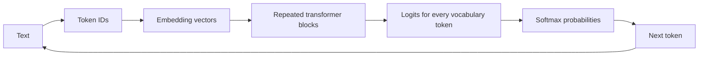

The hard part is not that the basic operations are individually complicated. The hard part is that there are many parameters, many layers, many tokens, and a lot of engineering needed to train and serve the model efficiently.

## Learning Path

Read the tutorial in this order:

1. Understand next-token prediction.
2. Understand why text becomes tokens.
3. Understand embeddings as high-dimensional vectors.
4. Understand dot products as similarity.
5. Understand matrix multiplication as many learned feature tests at once.
6. Understand the residual stream as the model's running state.
7. Understand attention as moving information between token positions.
8. Understand causal masking as preventing future leakage.
9. Understand multi-head attention as several routing mechanisms in parallel.
10. Understand RoPE as position encoded through rotation.
11. Understand feed-forward networks as feature transformers and memory-like storage.
12. Understand logits, softmax, sampling, and why chat output can vary.
13. Understand loss, gradients, backpropagation, and learning rate.
14. Understand the data pipeline and token budget.
15. Understand KV caching and why inference differs from training.
16. Understand why GPU memory movement, kernels, FlashAttention, fusion, and precision dominate performance.
17. Understand modern variants such as MoE and latent attention as changes to the same core loop.

## How To Read Each Mechanism

> For every mechanism, explain both what is done and why a model designer would choose to do it.

Many transformer explanations stop at the first part. They say "compute Q, K, and V, take dot products, softmax, aggregate values." That is a recipe, but it does not answer the design question:

> If I were designing this model, why would I introduce this mechanism at all?

This tutorial uses the following reading frame:

| Question | Meaning |
| --- | --- |
| What is done? | The operation, tensor shape, or algorithmic step. |
| Why do it? | The design pressure it solves. |
| What would go wrong without it? | The limitation the mechanism removes. |
| What does training learn? | Which numbers are learned rather than hand-coded. |

Example:

| Mechanism | What is done | Why it exists |
| --- | --- | --- |
| Q/K/V attention | Make separate query, key, and value projections. | Separate "what am I looking for?", "am I relevant?", and "what information should I send?" |
| Causal mask | Hide future positions before softmax. | Let training process full blocks in parallel without cheating. |
| Residual stream | Add each block's output back into the current state. | Preserve existing information while accumulating refinements. |

Keep asking this design question while reading: "What problem would this solve if I were building the model from scratch?"

## The Big Mental Model

A GPT-style language model is an autoregressive next-token model. Autoregressive means it feeds its own output back into its input.

| What is done? | Why do it? |
| --- | --- |
| Train the model to predict the next token from the previous tokens. | Text already supplies almost unlimited training examples: every token in every document becomes a target. |
| Generate one token, append it, and repeat. | This turns a next-token predictor into a system that can produce arbitrary-length text. |
| Produce a probability distribution, not only one word. | The model can represent uncertainty, and decoding can choose between precision and variety. |

If you were designing a language model from scratch, next-token prediction is attractive because it does not require humans to label grammar, facts, topics, or reasoning steps. The supervision is already present in raw text.

For example:

```text
The cat sits on the
```

The model predicts a distribution over possible next tokens:

| Token | Probability |
| --- | ---: |
| `table` | 42% |
| `floor` | 22% |
| `mat` | 16% |
| `roof` | 9% |
| `chair` | 6% |
| other tokens | 5% |

The model is not directly "thinking in words." Internally, it produces one score for every token in the vocabulary. If the vocabulary has 32,000 tokens, the output at a position is a vector of 32,000 scores. These raw scores are called logits. A softmax turns logits into probabilities.

The simplest generation loop is:

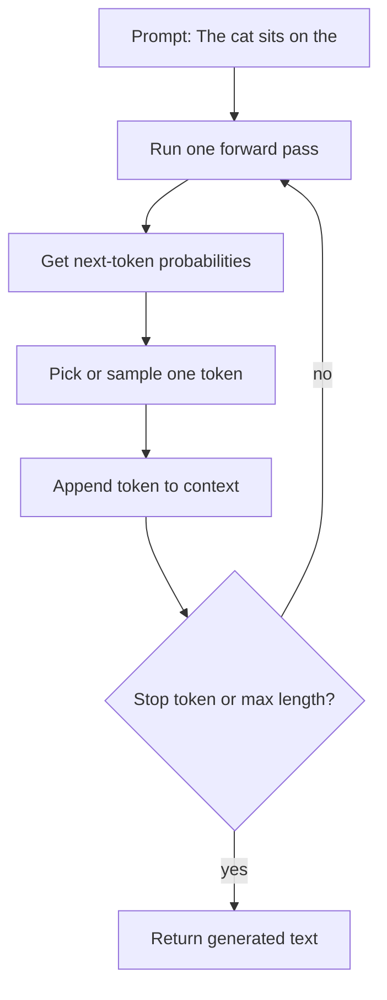

If the model chooses `table`, the next step uses the longer context:

```text
The cat sits on the table
```

Then it predicts another token, perhaps `in`, and so on:

```text
The cat sits on the table in the living room.
```

This explains why model output appears one piece at a time. The full answer is not produced in one atomic operation. It is generated token by token.

## Training Versus Inference

Training and inference use the same model weights, but they use them differently.

During training, the model sees a whole context block and learns many next-token predictions in parallel. For:

```text
The cat sits on the table
```

the training examples inside the block are conceptually:

| Prefix | Target next token |
| --- | --- |
| `The` | `cat` |
| `The cat` | `sits` |
| `The cat sits` | `on` |
| `The cat sits on` | `the` |
| `The cat sits on the` | `table` |

This is why training can use the GPU well: all token positions in a block can be processed at once, with a causal mask preventing later tokens from leaking into earlier predictions.

During inference, generation is sequential:

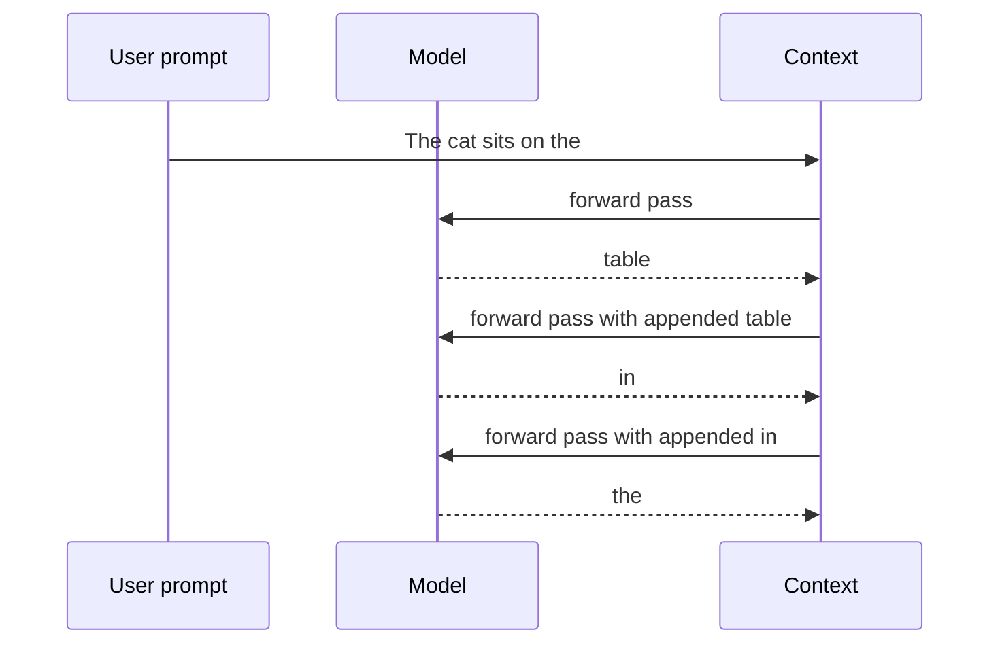

The outer loop is sequential because token $n+1$ depends on token $n$. KV caching improves this greatly, but it does not remove the dependency chain.

## Why This Is Not Magic

A useful analogy from the talk is the older world of analog and mechanical computers. Before modern digital CPUs were practical for every problem, engineers built physical systems that solved equations by continuously transforming quantities. Guidance systems, mechanical integrators, and analog control systems did not execute symbolic Python-like rules. They transformed state.

LLMs are not analog computers in the physical-hardware sense. They run on digital GPUs. The analogy is about representation and computation:

- The state is a large collection of real-valued numbers.
- Meaning is distributed across directions in vector space.
- Computation is a long chain of continuous transformations.
- The system is trained by nudging numbers, not by writing explicit symbolic rules.

The model does not contain a line like:

```text
if subject == "cat" and verb == "sits" and preposition == "on":
    predict "table"
```

Instead, training makes vector directions and matrix weights such that contexts involving cats, sitting, and surfaces tend to move the final representation closer to the output vector for tokens such as `table`, `mat`, or `floor`.

## Tokens: Text Is Not What The Model Directly Sees

Humans see characters, words, and sentences. A transformer sees integer token IDs.

| What is done? | Why do it? |
| --- | --- |
| Convert text into token IDs before the model sees it. | Neural networks operate on fixed vocabulary indices and vectors, not raw Unicode strings. |
| Use subword tokens instead of only characters or only words. | Characters make sequences too long; whole words fail on rare words, compounds, names, and code. |
| Keep the tokenizer fixed during model training. | The model needs a stable vocabulary so each embedding row has a consistent meaning during learning. |

A tokenizer maps text into IDs:

```text
The cat sits
```

becomes something like:

```text
464, 3797, 10718
```

The exact IDs depend on the tokenizer. The ID itself does not carry meaning. It is an index into an embedding table. Meaning begins when the model looks up the vector for that ID.

Tokenization is a compromise:

- Character-level tokenization can represent anything, but sequences become long.
- Word-level tokenization is compact for common known words, but fails on rare words, compounds, names, typos, and code.
- Subword tokenization represents common fragments compactly while still being able to represent arbitrary text.

German is a good stress test because compounds and capitalization create many useful fragments. Code and JSON are also difficult because punctuation, casing, indentation, repeated delimiters, and rare identifiers all matter.

## Byte Pair Encoding

Byte Pair Encoding, or BPE, builds a vocabulary by repeatedly merging common adjacent pieces.

| What is done? | Why do it? |
| --- | --- |
| Count frequent adjacent byte/character pairs. | Frequent pairs are good candidates for becoming reusable subword units. |
| Merge the most common pair into a new token. | Common fragments become shorter, reducing sequence length and compute. |
| Repeat until the vocabulary budget is reached. | The model gets a fixed-size vocabulary that balances compactness and coverage. |

The process is simple:

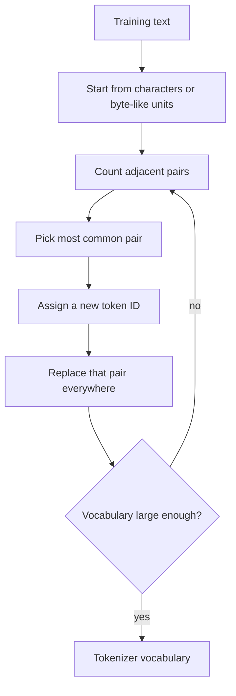

For a toy German-like example, the early merges might be:

| Pair | New token |
| --- | --- |
| `ch` | `<256>` |
| `en` | `<257>` |
| `er` | `<258>` |

The model benefits because common fragments become short. Rare strings are still representable because they can fall back to smaller pieces.

This matters because tokens cost compute. If a German sentence takes more tokens than the same idea in English, then the model spends more context length and more attention work on the same amount of meaning. A tokenizer that wastes many IDs on unhelpful variants reduces the effective capacity of the model.

## Vocabulary Size

Two useful reference vocabulary sizes are:

| Model/tokenizer | Vocabulary size | Rough ID bits |
| --- | ---: | ---: |
| GPT-2 | 50,257 tokens | about 16 bits |
| Nanoschnack | 32,000 tokens | about 15 bits |

The number of bits for the ID is not the model's representation of meaning. A token ID is just a row number. The learned vector for that row is where the useful representation lives.

## Embeddings: Token IDs Become Vectors

An embedding table is a learned lookup table.

| What is done? | Why do it? |
| --- | --- |
| Replace each token ID with a learned vector. | A bare integer ID has no useful geometry; a vector can encode similarity, features, and directions. |
| Learn the embedding table from prediction loss. | The model discovers which tokens should be near each other instead of relying on hand-written labels. |
| Use the same vector width for every token. | The transformer can process all positions with the same matrix operations. |

If the vocabulary has 32,000 tokens and the model width is 768, the embedding table has shape:

$$
32000 \times 768
$$

Each row is the learned vector for one token.

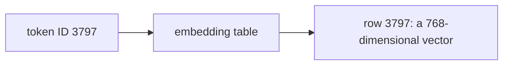

The simplest way to think about this is: the token ID is like an array index. If token `3797` means `cat` for this tokenizer, then the model does not do arithmetic with the number `3797` itself. It uses `3797` to select row 3797 of the embedding table.

In tiny Python form:

```python
import numpy as np

# Toy vocabulary of 4 tokens, embedding width of 3.
embedding_table = np.array([
    [ 0.10,  0.20, -0.10],  # token 0
    [ 1.00,  0.80,  0.10],  # token 1, imagine "cat"
    [ 0.90,  0.75,  0.20],  # token 2, imagine "dog"
    [-0.40,  0.10,  1.20],  # token 3, imagine "rocket"
])

token_id = 1
x = embedding_table[token_id]
print(x)  # [1.  0.8 0.1]
```

This is why people sometimes say an embedding layer is "just a lookup table." The lookup itself is simple. The important part is that the table entries are learned during training.

A toy vector might look like:

$$
x_{\text{cat}} =
\begin{bmatrix}
1.84 & 1.17 & -0.33 & -0.88 & -0.66 & -0.17 & \cdots
\end{bmatrix}
$$

Do not interpret dimension 0 as "catness" and dimension 1 as "animalness." Real embeddings are distributed. A concept usually lives as a direction or subspace spread across many dimensions.

The important idea is directional:

> Tokens used in similar contexts tend to acquire vectors that point in similar directions.

If `cat` and `dog` both appear near words like `pet`, `fur`, `animal`, `food`, `sits`, and `sleeps`, then training benefits from putting their vectors in related regions of space. If `cat` and `rocket` are useful in very different contexts, their representations need to differ.

You can see that idea even in the toy vectors above. `cat` and `dog` are numerically close, while `rocket` points in a different direction:

```python
cat = embedding_table[1]
dog = embedding_table[2]
rocket = embedding_table[3]

print(cat - dog)     # small differences
print(cat - rocket)  # much larger differences
```

Real embeddings are hundreds or thousands of dimensions wide, and the numbers are not hand-designed. The training process discovers useful coordinates because useful coordinates reduce prediction loss.

## Vector Spaces: The Missing Intuition

A vector is just a list of numbers.

| What is done? | Why do it? |
| --- | --- |
| Represent token state as a high-dimensional vector. | A vector gives the model many continuous degrees of freedom for representing partial, overlapping features. |
| Use directions and distances rather than symbolic flags. | Similarity and graded feature strength become simple geometry. |
| Let features be distributed across dimensions. | The model can reuse dimensions efficiently instead of needing one clean slot per human concept. |

In 2D:

$$
v = \begin{bmatrix}2 \\ 1\end{bmatrix}
$$

You can draw this as an arrow from the origin to the point $(2, 1)$.

The length of that vector is found with the Pythagorean theorem:

$$
\lVert v \rVert = \sqrt{2^2 + 1^2} = \sqrt{5} \approx 2.24
$$

That is all "norm" means here: vector length. For a 768-dimensional vector, the formula is the same idea with more terms:

$$
\lVert x \rVert =
\sqrt{x_0^2 + x_1^2 + \cdots + x_{767}^2}
$$

In 3D:

$$
v = \begin{bmatrix}2 \\ 1 \\ -3\end{bmatrix}
$$

In an LLM:

$$
v = \begin{bmatrix}x_0 \\ x_1 \\ x_2 \\ \vdots \\ x_{767}\end{bmatrix}
$$

You cannot draw all 768 dimensions, but the same ideas still apply:

- The vector has a length, also called magnitude or norm.
- The vector has a direction.
- Two vectors can have an angle between them.
- You can add and subtract vectors.
- You can project a vector into another space.
- You can compute dot products to measure alignment.

The student-level mental model is:

> Meaning is represented by useful position and direction in a high-dimensional learned space.

This is not a philosophical claim that the model understands like a human. It is an operational claim: vector positions and directions are useful for prediction.

The difference between position and direction matters:

- Position is where the vector is in the space.
- Direction is where it points relative to the origin.
- Length is how far it is from the origin.

In many similarity comparisons, direction matters more than raw length. If two vectors point in almost the same direction, they can represent related features even if one is longer than the other.

Small Python check:

```python
import numpy as np

v = np.array([2.0, 1.0])
length = np.linalg.norm(v)

print(length)  # 2.236067977...
print(v / length)  # same direction, length 1
```

The normalized vector `v / length` points the same way as `v`, but its length is exactly 1. This is useful because it lets us compare directions without length dominating the comparison.

## Dot Products Measure Alignment

Dot products are the basic alignment test used throughout the transformer.

| What is done? | Why do it? |
| --- | --- |
| Multiply matching components and add them. | This gives one number measuring how aligned two vectors are. |
| Use dot products for similarity tests. | Attention and output prediction need a cheap way to ask "does this match that?" many times. |
| Scale or normalize when needed. | Raw vector length can otherwise dominate direction-based similarity. |

For two vectors:

$$
a = \begin{bmatrix}a_1 \\ a_2 \\ a_3\end{bmatrix},
\quad
b = \begin{bmatrix}b_1 \\ b_2 \\ b_3\end{bmatrix}
$$

the dot product is:

$$
a \cdot b = a_1b_1 + a_2b_2 + a_3b_3
$$

A concrete example:

$$
a = \begin{bmatrix}2 \\ 1\end{bmatrix},
\quad
b = \begin{bmatrix}3 \\ 0\end{bmatrix}
$$

Then:

$$
a \cdot b = 2 \cdot 3 + 1 \cdot 0 = 6
$$

The dot product is large because both vectors point substantially in the positive x direction.

Now compare:

$$
c = \begin{bmatrix}0 \\ 3\end{bmatrix}
$$

Then:

$$
a \cdot c = 2 \cdot 0 + 1 \cdot 3 = 3
$$

This is still positive, but smaller, because $a$ points partly upward but not as strongly as it points rightward.

For an orthogonal vector:

$$
d = \begin{bmatrix}-1 \\ 2\end{bmatrix}
$$

Then:

$$
a \cdot d = 2 \cdot (-1) + 1 \cdot 2 = 0
$$

Zero means the vectors are at a right angle. They do not point in the same direction at all.

Geometrically:

$$
a \cdot b = \lVert a\rVert \lVert b\rVert \cos(\theta)
$$

where $\theta$ is the angle between them.

Cosine similarity removes the effect of vector length:

$$
\cos(\theta) = \frac{a \cdot b}{\lVert a\rVert \lVert b\rVert}
$$

Interpretation:

| Relationship | Cosine value | Meaning |
| --- | ---: | --- |
| Same direction | near $1$ | Strongly aligned |
| Orthogonal | near $0$ | Little alignment |
| Opposite direction | near $-1$ | Opposed |

This is why dot products show up everywhere in transformer models. A dot product asks a very useful question:

> How much does this vector point in that direction?

Python version:

```python
import numpy as np

def cosine_similarity(a, b):
    return np.dot(a, b) / (np.linalg.norm(a) * np.linalg.norm(b))

a = np.array([2.0, 1.0])
b = np.array([3.0, 0.0])
c = np.array([0.0, 3.0])
d = np.array([-1.0, 2.0])

print(np.dot(a, b), cosine_similarity(a, b))  # aligned-ish
print(np.dot(a, c), cosine_similarity(a, c))  # less aligned
print(np.dot(a, d), cosine_similarity(a, d))  # orthogonal
```

In an LLM, the same operation happens with longer vectors. A query vector and a key vector may each have 64 dimensions instead of 2, but the compatibility score is still just multiply matching components, add the products, and interpret the result as alignment.

## Vector Arithmetic As Meaning Movement

Vector arithmetic can encode directions of change. A famous intuition is:

$$
\text{king} - \text{man} + \text{woman} \approx \text{queen}
$$

Do not treat this as an exact law. It is a clue. The difference vector:

$$
\text{woman} - \text{man}
$$

can represent a direction of change. Adding a similar direction to the `king` vector can move the result toward `queen`.

The same idea appears in smaller examples:

| Starting idea | Transformation direction | Resulting direction |
| --- | --- | --- |
| red | add "complementary color" | cyan-ish |
| singular noun | add "plural" | plural noun |
| German region | add "person from region" | demonym |
| `The cat sits on the` | add context about cats and surfaces | `table` becomes likely |

The transformer repeatedly updates vectors. It adds information from relevant tokens, suppresses irrelevant directions, rotates query/key vectors for position, and moves final hidden states toward output token vectors that fit the context.

## Matrix Multiplication: Many Dot Products At Once

If a vector is a list of numbers, a matrix is a table of numbers.

| What is done? | Why do it? |
| --- | --- |
| Multiply a vector by a learned matrix. | The model can compute many learned feature tests at once. |
| Stack many learned directions into one matrix. | GPU hardware can evaluate thousands of dot products efficiently as matrix multiplication. |
| Reuse the same matrix across all token positions. | The model learns general operations that apply wherever a token appears in the sequence. |

For example:

$$
W =
\begin{bmatrix}
1 & 0 \\
0 & 1 \\
1 & 1
\end{bmatrix}
$$

and:

$$
x =
\begin{bmatrix}
2 \\
3
\end{bmatrix}
$$

Multiplying $W$ by $x$ means: take the dot product of each row of $W$ with $x$.

$$
Wx =
\begin{bmatrix}
1 \cdot 2 + 0 \cdot 3 \\
0 \cdot 2 + 1 \cdot 3 \\
1 \cdot 2 + 1 \cdot 3
\end{bmatrix}
=
\begin{bmatrix}
2 \\
3 \\
5
\end{bmatrix}
$$

That is the whole trick. A matrix can ask several questions about a vector at the same time:

| Row of $W$ | Question it asks about $x=[2,3]$ | Answer |
| --- | --- | ---: |
| `[1, 0]` | How much first component? | 2 |
| `[0, 1]` | How much second component? | 3 |
| `[1, 1]` | How much combined total? | 5 |

In neural networks, the rows or columns of a learned matrix can act like feature detectors. They are not usually human-readable, but the idea is the same. A learned row might detect whether a token state contains a feature useful for noun agreement, a code delimiter, a German compound fragment, or a relation to an earlier word.

Python version:

```python
import numpy as np

W = np.array([
    [1.0, 0.0],
    [0.0, 1.0],
    [1.0, 1.0],
])

x = np.array([2.0, 3.0])

print(W @ x)  # [2. 3. 5.]
```

The same idea scales to transformer dimensions. A projection from 768 dimensions to 64 dimensions can be viewed as 64 learned dot products. Each output dimension asks one learned question about the 768-dimensional input.

Depending on code convention, you may see either:

$$
y = Wx
$$

or:

$$
y = xW
$$

The difference is whether vectors are treated as columns or rows. The mathematical idea is the same. PyTorch often stores batches as rows, so transformer code commonly uses:

$$
XW
$$

where $X$ is a batch or sequence matrix.

## Projection: Looking At A Vector Through A Learned Lens

A projection maps a vector into another space.

| What is done? | Why do it? |
| --- | --- |
| Multiply the token state by a learned projection matrix. | Create a view of the token specialized for one job. |
| Project the same token into Q, K, and V spaces. | Split matching from payload: one representation asks, one advertises, one carries content. |
| Usually project to a smaller head dimension. | Let each head focus on a lower-dimensional relation while keeping compute manageable. |

That sentence is technically correct, but it is too abstract. Start with a physical picture: a 3D object casts a 2D shadow. The shadow is not the whole object, but it can preserve the information you care about from one viewpoint. If you shine the light from a different angle, you get a different shadow. Same object, different view.

In vector math, a projection is like choosing a view of a vector. The model starts with a rich token state, such as a 768-dimensional vector, and asks for a smaller view that is useful for a specific job.

For attention, the model computes:

$$
q = xW_Q,\quad k = xW_K,\quad v = xW_V
$$

The same original vector $x$ is multiplied by three different learned matrices. The result is three different views of the same token state.

| Projection | Informal question |
| --- | --- |
| Query $q$ | What is this token looking for? |
| Key $k$ | What does this token advertise as matchable? |
| Value $v$ | What information will this token send if selected? |

The important part is that a projection is not just "making the vector smaller." It is making a purpose-built representation.

An everyday analogy:

| Object | Projection/view | What the view is good for |
| --- | --- | --- |
| A person | Passport photo | Identity check |
| A person | X-ray | Bone structure |
| A person | Calendar entry | Availability |
| A word token | Query vector | What this position needs |
| A word token | Key vector | Whether this position is relevant |
| A word token | Value vector | What this position contributes |

Each view throws away many details and emphasizes others. A passport photo is bad for diagnosing a broken arm. An X-ray is bad for recognizing someone's eye color. Likewise, a query vector is not necessarily the right representation to send as content, and a value vector is not necessarily the right representation to match against.

The Nanoschnack/GPT-2-like numbers are:

| Object | Shape |
| --- | --- |
| Residual token vector | $1 \times 768$ |
| Query projection per head | $768 \times 64$ |
| Key projection per head | $768 \times 64$ |
| Value projection per head | $768 \times 64$ |
| Query/key/value vector per head | $1 \times 64$ |

So one attention head projects a full 768-dimensional token state into a 64-dimensional relation space. Different heads learn different relation spaces.

The phrase "relation space" means: a space where a certain kind of comparison becomes easy. One head may learn a space where determiner-noun relationships are easy to compare. Another may learn a space where nearby punctuation or code delimiters matter. Another may learn a space useful for subject-verb agreement. These labels are illustrative; the model learns the spaces, and they are not guaranteed to be human-readable.

### Why The Projection Is Linear And Smaller

The projection is linear because a matrix multiply is the simplest trainable way to select and mix features from the current token state. Every output coordinate is a learned weighted combination of input coordinates. If the residual vector has information about token identity, syntax, position, previous context, punctuation, and topic, a projection can learn which mixtures are useful for one job.

This is not a bijection. A bijection would mean no information is lost: every input vector could be perfectly reconstructed from the output vector. Attention projections usually do something different. They down-transform a large residual vector into a smaller space that keeps the information needed for a specific attention role.

That down-transforming has two reasons:

| Reason | What it means |
| --- | --- |
| Feature selection | The head should not use the entire residual stream directly. It should learn which features matter for matching or content transfer. |
| Efficiency | Smaller Q/K/V vectors make dot products cheaper and make the KV cache much smaller. |

Suppose the residual state has 768 dimensions and a head uses 64-dimensional keys and queries. The score:

$$
q_i \cdot k_j
$$

now costs 64 multiply-adds instead of 768. More importantly, keys and values are stored for every cached token, layer, and head during inference. If K and V stayed at full model width, the cache would become far too large.

So the projection is doing two jobs at once:

1. Learn a useful view of the token state.
2. Make the attention computation and cache economically possible.

This is one reason Q/K/V projections are not just a mathematical decoration. They are part of the architecture's practicality.

### A Projection In Two Dimensions

Take a 2D vector:

$$
x =
\begin{bmatrix}
3 \\
4
\end{bmatrix}
$$

If we project onto the x-axis, we keep only the first coordinate:

$$
\text{x-axis view} = 3
$$

If we project onto the y-axis, we keep only the second coordinate:

$$
\text{y-axis view} = 4
$$

Those are two different views of the same vector. Both are valid. Neither is the whole vector.

We can also project onto a diagonal direction. Use the unit direction:

$$
u =
\begin{bmatrix}
\frac{1}{\sqrt{2}} \\
\frac{1}{\sqrt{2}}
\end{bmatrix}
$$

The amount of $x$ pointing in that diagonal direction is the dot product:

$$
x \cdot u
=
3\frac{1}{\sqrt{2}} + 4\frac{1}{\sqrt{2}}
=
\frac{7}{\sqrt{2}}
\approx 4.95
$$

So a projection can mean: "How much does this vector point in this chosen direction?"

Python version:

```python
import numpy as np

x = np.array([3.0, 4.0])

x_axis = np.array([1.0, 0.0])
y_axis = np.array([0.0, 1.0])
diagonal = np.array([1.0, 1.0])
diagonal = diagonal / np.linalg.norm(diagonal)

print(np.dot(x, x_axis))    # 3.0
print(np.dot(x, y_axis))    # 4.0
print(np.dot(x, diagonal))  # 4.949...
```

Now replace the human-chosen directions with learned directions. That is what transformer projection matrices do. Instead of asking only "how much x-axis?" or "how much y-axis?", the model learns many directions that are useful for prediction.

### A Projection Matrix As Several Learned Questions

Suppose a tiny token state has four dimensions:

$$
x =
\begin{bmatrix}
1.0 & 0.5 & -0.2 & 0.1
\end{bmatrix}
$$

You can imagine these dimensions as four hidden features. In a real model they are not cleanly named, but for the example pretend they are:

| Dimension | Toy meaning |
| ---: | --- |
| 0 | noun-like signal |
| 1 | animal-like signal |
| 2 | action-like signal |
| 3 | punctuation-like signal |

Now define a projection matrix:

$$
W_Q =
\begin{bmatrix}
1.0 & 0.0 \\
0.0 & 1.0 \\
0.5 & -0.5 \\
-1.0 & 0.2
\end{bmatrix}
$$

Because we are using row-vector convention, $xW_Q$ maps 4 dimensions to 2 dimensions:

$$
xW_Q =
\begin{bmatrix}
0.8 & 0.62
\end{bmatrix}
$$

The first output coordinate is:

$$
1.0(1.0) + 0.5(0.0) + (-0.2)(0.5) + 0.1(-1.0)
=
0.8
$$

The second output coordinate is:

$$
1.0(0.0) + 0.5(1.0) + (-0.2)(-0.5) + 0.1(0.2)
=
0.62
$$

So the projection asked two learned questions:

| Output coordinate | What happened |
| ---: | --- |
| 0 | Mixed dimensions 0, 2, and 3 |
| 1 | Mixed dimensions 1, 2, and 3 |

This is why "projection" is more precise than "compression." Compression suggests keeping as much information as possible in fewer numbers. Attention projections do not necessarily try to preserve everything. They try to create a useful view for a specific computation.

Toy projection example:

```python
import numpy as np

# A tiny "token state" with 4 features.
x = np.array([1.0, 0.5, -0.2, 0.1])

# A learned projection from 4 dimensions down to 2 dimensions.
# In a real model, W_Q is learned. Here we choose simple numbers.
W_Q = np.array([
    [ 1.0,  0.0],
    [ 0.0,  1.0],
    [ 0.5, -0.5],
    [-1.0,  0.2],
])

q = x @ W_Q
print(q)  # [0.8  0.62]
```

Read the output as a new 2-dimensional description of the same token. The projection kept some information, mixed some information, and discarded some information. A real attention head does this so that query/key comparisons become useful.

### Why Q And K Are Separate

The query and key projections cooperate. The query says what the current token wants. The key says what each source token offers. Attention compares them with a dot product.

Imagine the current token is `table`. It may ask a question like:

> I am looking for words that explain what is on me or what relation I am part of.

The earlier token `sits` may offer a key like:

> I am a verb/relation that can connect a subject to a location or surface.

If those two learned vectors point in similar directions, their dot product is high, and `table` attends to `sits`.

The earlier token `the` may offer a key that is less useful for this query, so the dot product is lower.

Tiny example:

```python
import numpy as np

q_table = np.array([1.0, 0.8])

k_the = np.array([0.1, 0.0])
k_cat = np.array([0.6, 0.4])
k_sits = np.array([1.0, 0.9])

print(np.dot(q_table, k_the))   # 0.10
print(np.dot(q_table, k_cat))   # 0.92
print(np.dot(q_table, k_sits))  # 1.72
```

The numbers say that `sits` is the best match for this query. In a real model, the query and keys are learned from data, not manually designed.

### Why V Is Separate From K

The key decides whether a token should be selected. The value is the information that gets sent after selection.

Those are different jobs.

For example, `sits` may use a key that says "I am relevant to a token looking for a surface relation." But the value it sends might contain information more like "there is a sitting action involving the subject." Matching information and payload information are not necessarily the same.

This separation is powerful:

- $Q$ and $K$ create the addressing system.
- Softmax decides how strongly each address matches.
- $V$ carries the content.

Computer analogy:

| Attention part | Rough computer analogy |
| --- | --- |
| Query | Address request |
| Key | Address label |
| Dot product | Address match score |
| Softmax | How much to read from each address |
| Value | Data stored at that address |

This is only an analogy, but it explains why there are three projections instead of one.

### Projection Is Learned During Training

The model designer does not decide that one projection dimension means "subject" and another means "verb." The designer only chooses the shapes:

$$
768 \rightarrow 64
$$

Training fills in the matrix values. If a certain projection helps reduce next-token loss, backpropagation reinforces it. If it does not help, training changes it.

That means a projection matrix starts as random numbers and slowly becomes a useful lens.

Minimal example of a learned-looking lens:

```python
import numpy as np

# Pretend x_table is a token state after several layers.
x_table = np.array([0.9, 0.2, 0.7, -0.1])

# Pretend training has learned that this query projection should
# emphasize dimensions 0 and 2 and mostly ignore dimension 3.
W_Q = np.array([
    [1.0, 0.2],
    [0.1, 0.4],
    [0.8, 1.0],
    [0.0, 0.1],
])

q_table = x_table @ W_Q
print(q_table)
```

The output is not "meaning" by itself. It is useful because it will be compared to keys from other tokens. Projection only makes full sense inside the larger attention operation.

### The Core Intuition

If you remember only one thing from this section, remember this:

> A projection is a learned way of asking a smaller set of useful questions about a larger vector.

For attention:

- The query projection asks: what should this position look for?
- The key projection asks: what kind of match does this position offer?
- The value projection asks: what information should this position send if it is selected?

The model learns these questions because useful questions reduce prediction loss.

## Sequences Become Matrices

A single token embedding is a vector:

$$
1 \times 768
$$

A context of $T$ tokens becomes a matrix:

$$
T \times 768
$$

For six tokens:

```text
the cat sits on the table
```

the hidden state is conceptually:

$$
6 \times 768
$$

Each row is the current state for one token position. The transformer repeatedly transforms this matrix:

- Attention lets rows communicate.
- Feed-forward networks transform each row independently.
- Residual connections keep the old row state while adding updates.

## Decoder-Only Transformer Overview

A GPT-style model uses a decoder-only transformer stack:

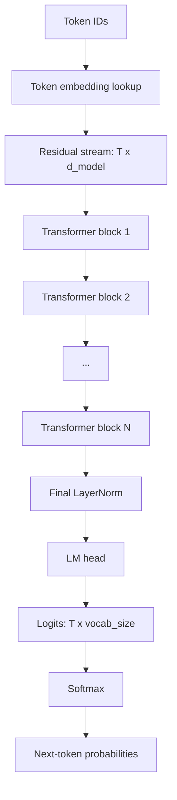

One transformer block has this shape:

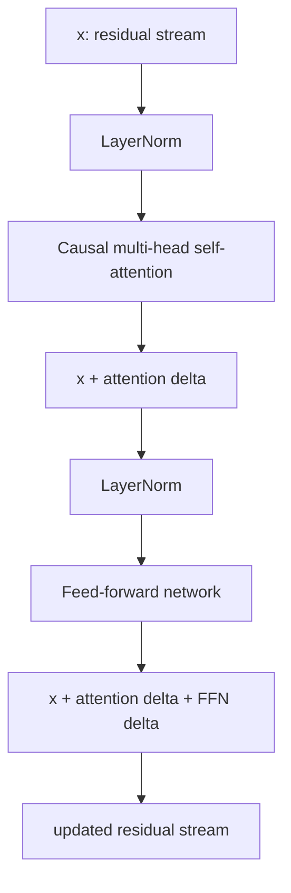

Typical GPT-2-like reference numbers:

| Hyperparameter | Example value |
| --- | ---: |
| Model width | 768 |
| Attention head size | 64 |
| Attention heads | 8 in the Nanoschnack examples |
| Transformer blocks | 12 for GPT-2-like scale |
| Vocabulary | 32,000 for Nanoschnack, 50,257 for GPT-2 |
| MLP expansion | 768 to 3072 to 768 |

The exact numbers are hyperparameters. They are chosen before training and evaluated empirically.

## The Residual Stream

The residual stream is the main state flowing through the model.

| What is done? | Why do it? |
| --- | --- |
| Keep a running vector state for every token position. | The model needs a place to accumulate information across layers. |
| Add attention and MLP outputs instead of replacing the state. | New information refines the old state without destroying it. |
| Pass the residual stream through the whole stack. | Later layers can build on earlier features and context. |

One useful CPU analogy is an accumulator: an operation does not replace the accumulator with unrelated data; it updates it.

In a transformer:

$$
x \leftarrow x + \operatorname{Attention}(x)
$$

then:

$$
x \leftarrow x + \operatorname{MLP}(x)
$$

The rule of thumb is:

> Never replace, only augment.

For one token position:

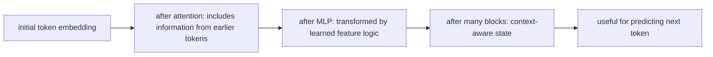

This matters because the token remains itself while gaining context. The vector for `table` should still contain table-related information, but after attention it may also contain "a cat is sitting on it." After the MLP it may be moved toward features that make a plausible continuation easier to predict.

## LayerNorm

Layer normalization stabilizes the values flowing through the residual stream.

| What is done? | Why do it? |
| --- | --- |
| Normalize each token vector by its own mean and variance. | Keep activations on a predictable scale as layers accumulate updates. |
| Apply learned scale and bias after normalization. | Let the model recover useful scale/offset while staying stable. |
| Use it before attention and MLP in pre-norm blocks. | Make each sublayer receive well-conditioned input. |

For one token vector $x$, LayerNorm computes a mean and variance across the vector dimensions:

$$
\mu = \frac{1}{d}\sum_{i=1}^{d} x_i
$$

$$
\sigma^2 = \frac{1}{d}\sum_{i=1}^{d}(x_i - \mu)^2
$$

Then it normalizes and applies learned scale and bias:

$$
\operatorname{LayerNorm}(x)_i =
\gamma_i \frac{x_i - \mu}{\sqrt{\sigma^2 + \epsilon}} + \beta_i
$$

Work through a tiny example:

$$
x = \begin{bmatrix}2 \\ 4 \\ 6\end{bmatrix}
$$

The mean is:

$$
\mu = \frac{2 + 4 + 6}{3} = 4
$$

The variance is:

$$
\sigma^2 =
\frac{(2-4)^2 + (4-4)^2 + (6-4)^2}{3}
=
\frac{8}{3}
\approx 2.67
$$

The normalized vector, ignoring $\epsilon$, $\gamma$, and $\beta$ for the moment, is approximately:

$$
\begin{bmatrix}
-1.22 \\
0 \\
1.22
\end{bmatrix}
$$

Notice what happened: the middle value became 0, the low value became negative, and the high value became positive. The vector now has a stable centered scale.

Python version:

```python
import numpy as np

x = np.array([2.0, 4.0, 6.0])

mean = x.mean()
var = ((x - mean) ** 2).mean()
eps = 1e-5
normalized = (x - mean) / np.sqrt(var + eps)

print(mean)        # 4.0
print(var)         # 2.666...
print(normalized)  # [-1.2247  0.      1.2247]
```

In the real model, $\gamma$ and $\beta$ are learned. That means the model can decide the best scale and offset after normalization. LayerNorm does not erase all information; it keeps relative patterns while preventing uncontrolled scale drift.

Why this helps:

- Values do not drift without bound as residual updates accumulate.
- Each block receives input on a more predictable scale.
- Optimization becomes easier because gradients behave more consistently.

In many modern GPT-style models, LayerNorm is used before attention and before the feed-forward network. This is often called pre-norm.

## Attention: The Routing Mechanism

Attention answers:

> For each token position, which earlier token positions should influence it, and by how much?

| What is done? | Why do it? |
| --- | --- |
| Build Q, K, and V vectors for every token. | Give each token a way to request information, advertise relevance, and provide content. |
| Compare each query with previous keys using dot products. | Compute trainable relevance scores between token positions. |
| Softmax the scores into weights. | Turn arbitrary relevance scores into a controlled mixture. |
| Use the weights to sum value vectors. | Move information from relevant previous tokens into the current token state. |

If you were designing this from scratch, the problem is: each token starts with only local information, but language depends on relationships between tokens. In `the cat sits on the table`, the representation at `table` needs information from `cat`, `sits`, and `on`. Attention is the mechanism that lets the model choose which earlier positions matter for the current position.

The reason for Q/K/V is separation of concerns:

- Query: the current position's request.
- Key: each source position's match label.
- Value: the content to transfer if the match is strong.

Without this split, the same vector would have to serve as request, address label, and payload. That is possible in a toy system, but it unnecessarily ties together three different jobs. Q/K/V gives training more freedom: a token can match using one learned view and send content using another learned view.

In:

```text
the cat sits on the table
```

the token `table` may need information from `sits`, `on`, and `cat`. Attention gives the model a trainable way to move information between token positions.

Here is the Q/K/V view:

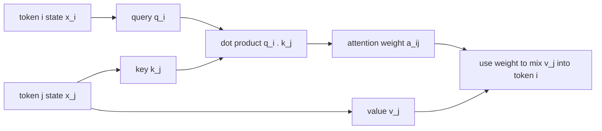

A helpful sentence:

> Token `table` forms a query. Token `sits` offers a key. If they match, `sits` sends a value.

The score for token $i$ attending to token $j$ is:

$$
\operatorname{score}_{ij} = q_i \cdot k_j
$$

In scaled dot-product attention:

$$
\operatorname{score}_{ij} = \frac{q_i \cdot k_j}{\sqrt{d_{\text{head}}}}
$$

If the head dimension is 64:

$$
\sqrt{64} = 8
$$

The scaling keeps dot products from becoming too large as the dimension grows. Without scaling, the softmax can become too sharp and gradients can become less useful.

Here is a toy attention computation with three tokens and 2-dimensional query/key/value vectors. Imagine the current token is `table`, and it can look back at `the`, `cat`, and `sits`.

```python
import numpy as np

tokens = ["the", "cat", "sits"]

# Tiny key vectors for source tokens.
K = np.array([
    [0.1, 0.0],  # "the"
    [0.8, 0.6],  # "cat"
    [1.0, 0.9],  # "sits"
])

# Tiny value vectors: what each token would send if attended to.
V = np.array([
    [0.0, 0.1],  # "the" sends little content
    [0.7, 0.2],  # "cat" sends subject-like information
    [0.9, 0.8],  # "sits" sends relation/action information
])

# Query from the current token position, e.g. "table".
q = np.array([1.0, 0.8])

scores = K @ q
print(scores)  # [0.1  1.28 1.72]
```

The highest score is for `sits`, because its key points most like the query. But attention does not normally choose just one source token. It turns the scores into weights:

```python
def softmax(x):
    x = x - np.max(x)  # stable softmax
    exp_x = np.exp(x)
    return exp_x / exp_x.sum()

weights = softmax(scores)
print(weights)  # roughly [0.10, 0.33, 0.52]
```

Then attention mixes the value vectors:

```python
delta = weights @ V
print(delta)  # weighted information sent into the current token
```

Conceptually, `table` receives a little information from `the`, more from `cat`, and most from `sits`. The result is not a word. It is another vector, an update that gets added into the current residual stream.

You can also see why softmax is important. The raw scores `[0.1, 1.28, 1.72]` are not a useful mixture by themselves. Softmax turns them into weights that sum to 1.

## The Attention Matrix

For a sequence of $T$ tokens, every querying position can compare against every source position. The scores form a matrix.

| What is done? | Why do it? |
| --- | --- |
| Compute all query-key scores as a $T \times T$ matrix. | Represent every possible token-to-token communication route in one tensor. |
| Treat rows as receivers and columns as sources. | Each token position gets its own distribution over where to read information from. |
| Later apply a mask for decoder-only models. | Keep the parallel matrix computation while enforcing left-to-right prediction. |

The shape is:

$$
T \times T
$$

Rows are query positions. Columns are source positions.

For six tokens:

```text
the cat sits on the table
```

there is a conceptual $6 \times 6$ attention score matrix.

| Query position | Source positions considered before masking |
| --- | --- |
| `the` | every token |
| `cat` | every token |
| `sits` | every token |
| `on` | every token |
| `the` | every token |
| `table` | every token |

But GPT-style models are causal, so future source positions are masked out.

## Causal Masking

During training, the full sequence is in memory. Without masking, the model could cheat.

| What is done? | Why do it? |
| --- | --- |
| Set future attention scores to $-\infty$ before softmax. | Future tokens then receive probability 0. |
| Keep current and previous positions visible. | Each position can learn from its prefix. |
| Process the whole block in parallel anyway. | Training stays efficient while preserving autoregressive behavior. |

If it is learning this prediction:

| Prefix | Target next token |
| --- | --- |
| `The cat sits` | `on` |

it must not see the future token `on` while predicting it.

A causal mask permits only the current and previous positions:

| Query token | Allowed source tokens |
| --- | --- |
| token 0 | 0 |
| token 1 | 0, 1 |
| token 2 | 0, 1, 2 |
| token 3 | 0, 1, 2, 3 |
| token 4 | 0, 1, 2, 3, 4 |

Conceptually, future entries in the score matrix become impossible before softmax:

$$
\operatorname{score}_{ij} =
\begin{cases}
\frac{q_i \cdot k_j}{\sqrt{d_{\text{head}}}}, & j \le i \\
-\infty, & j > i
\end{cases}
$$

After softmax, entries with $-\infty$ receive probability 0.

Tiny Python version:

```python
import numpy as np

scores = np.array([
    [1.0, 2.0, 3.0],
    [1.0, 2.0, 3.0],
    [1.0, 2.0, 3.0],
])

# Keep current and previous positions. Mask future positions.
mask = np.triu(np.ones_like(scores, dtype=bool), k=1)
masked_scores = scores.copy()
masked_scores[mask] = -np.inf

print(masked_scores)
# [[  1. -inf -inf]
#  [  1.   2. -inf]
#  [  1.   2.   3.]]
```

If you apply softmax row by row after this, future positions get zero probability. The model can train on a full sequence while each position behaves as if it only had access to the prefix.

This is the meaning of causal self-attention:

- Self-attention: tokens attend within the same sequence.
- Causal: information only flows from earlier positions to later positions.
- Multi-head: several attention mechanisms run in parallel.

## Softmax Turns Scores Into Weights

Raw scores can be any real numbers. Attention needs weights that are positive and sum to 1. Softmax is the standard conversion.

| What is done? | Why do it? |
| --- | --- |
| Exponentiate scores and divide by their sum. | Convert arbitrary scores into positive weights that sum to 1. |
| Preserve ordering of scores. | Larger compatibility scores become larger attention weights. |
| Keep the operation differentiable. | Backpropagation can train the scores and projections. |

Without softmax, a token could add unbounded amounts of information from many positions. Softmax makes attention a weighted read operation: every row chooses how to distribute one unit of attention over available source tokens.

$$
a_{ij} =
\frac{\exp(\operatorname{score}_{ij})}
{\sum_m \exp(\operatorname{score}_{im})}
$$

For each query row $i$, softmax produces a distribution over source positions $j$.

Properties:

- Every $a_{ij}$ is positive.
- The weights for one query row sum to 1.
- Larger scores get larger weights.
- Very negative scores become nearly 0.
- The function is differentiable, so training can adjust the scores.

A small example:

$$
\operatorname{scores} = \begin{bmatrix}1 \\ 2 \\ 4\end{bmatrix}
$$

Exponentials make larger numbers much larger:

$$
\exp(1) \approx 2.72,\quad
\exp(2) \approx 7.39,\quad
\exp(4) \approx 54.60
$$

The sum is:

$$
2.72 + 7.39 + 54.60 = 64.71
$$

So softmax gives approximately:

$$
\begin{bmatrix}
2.72/64.71 \\
7.39/64.71 \\
54.60/64.71
\end{bmatrix}
=
\begin{bmatrix}
0.04 \\
0.11 \\
0.84
\end{bmatrix}
$$

The biggest score gets most of the probability, but the other scores do not disappear entirely.

Python version:

```python
import numpy as np

scores = np.array([1.0, 2.0, 4.0])

exp_scores = np.exp(scores)
probs = exp_scores / exp_scores.sum()

print(probs)       # [0.042, 0.114, 0.844]
print(probs.sum()) # 1.0
```

In real implementations, use the stable version:

```python
def softmax(x):
    x = x - np.max(x)
    exp_x = np.exp(x)
    return exp_x / exp_x.sum()
```

## Values: What Actually Moves

The value vectors are the payload.

| What is done? | Why do it? |
| --- | --- |
| Multiply each source value by its attention weight. | Strong matches contribute more content than weak matches. |
| Sum the weighted values. | Combine information from several relevant tokens into one update vector. |
| Project and add the result to the residual stream. | Convert the head output back to model width and preserve previous state. |

After softmax, token $i$ receives a weighted sum of value vectors:

$$
\Delta_i = \sum_j a_{ij} v_j
$$

Then the result is written back into the residual stream:

$$
x_i \leftarrow x_i + \Delta_i W_O
$$

The roles are:

| Part | Analogy |
| --- | --- |
| Query | What I am looking for |
| Key | What I can be matched by |
| Value | What I send if selected |
| Softmax weight | How strongly I send it |
| Output projection | How the combined payload is written back |

## Attention As A Communication Bus

A useful systems analogy:

| Transformer part | CPU-ish analogy |
| --- | --- |
| Residual stream | Accumulator/register state |
| Attention | Bus for moving information between registers |
| Feed-forward network | ALU-like local transformation |

The analogy is imperfect, but it helps. Each token position owns a vector state. Attention lets positions send information to one another. Without attention, each token would be transformed independently and could not use context.

## Multi-Head Attention

One attention head is one learned relation space. Multi-head attention runs several relation spaces in parallel.

| What is done? | Why do it? |
| --- | --- |
| Run several Q/K/V attention heads in parallel. | Let the layer track several kinds of relationships at once. |
| Give each head its own projections. | Each head can learn a different relation space. |
| Concatenate head outputs and project back. | Merge the parallel relation-specific updates into the residual stream. |

If there were only one head, every relation would have to share one query-key-value space. That creates a bottleneck: syntax, local adjacency, long-range references, punctuation, and formatting would all compete for the same comparison mechanism. Multiple heads give the layer several independent routing mechanisms.

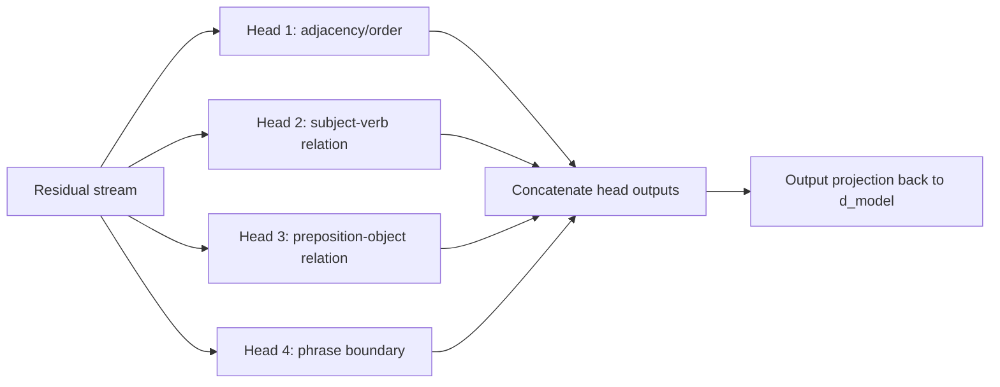

The labels are illustrative, not guaranteed. Real heads are learned and may not map cleanly to human-readable categories. But the architectural reason is clear: the model benefits from several independent ways of comparing and moving information.

For the Nanoschnack example:

$$
8 \text{ heads} \times 64 \text{ dimensions/head} = 512
$$

The model width is 768, so the concatenated head output is projected back into the residual stream width. In common implementations, all heads are packed into larger matrix multiplications for efficiency.

## RoPE: Position Through Rotation

Attention based only on content would not know order. The sentences:

```text
The cat sits on the table.
The table sits on the cat.
```

contain similar tokens, but their order changes the meaning.

RoPE, or rotational positional encoding, injects position into query and key vectors by rotating pairs of dimensions.

| What is done? | Why do it? |
| --- | --- |
| Rotate query and key dimension pairs by position-dependent angles. | Give attention access to token order and relative distance. |
| Use several rotation frequencies. | Represent both short-range and long-range position differences. |
| Preserve vector length while changing angle. | Position changes compatibility without destroying feature magnitude. |

Without a positional mechanism, attention would mostly see a bag of token contents. `cat sits on table` and `table sits on cat` contain similar tokens but mean different things. RoPE gives the dot product a way to depend on where tokens are relative to each other.

In 2D, a rotation by angle $\theta$ can be written:

$$
R_\theta =
\begin{bmatrix}
\cos \theta & -\sin \theta \\
\sin \theta & \cos \theta
\end{bmatrix}
$$

If $\theta = 90^\circ$, then $\cos(\theta)=0$ and $\sin(\theta)=1$:

$$
R_{90^\circ} =
\begin{bmatrix}
0 & -1 \\
1 & 0
\end{bmatrix}
$$

Apply it to a vector pointing right:

$$
\begin{bmatrix}
0 & -1 \\
1 & 0
\end{bmatrix}
\begin{bmatrix}
1 \\
0
\end{bmatrix}
=
\begin{bmatrix}
0 \\
1
\end{bmatrix}
$$

The vector now points upward. Its direction changed, but its length stayed 1.

Python version:

```python
import numpy as np

theta = np.pi / 2  # 90 degrees
R = np.array([
    [np.cos(theta), -np.sin(theta)],
    [np.sin(theta),  np.cos(theta)],
])

v = np.array([1.0, 0.0])
print(R @ v)  # [0. 1.]
```

RoPE applies this idea to many pairs of dimensions:

$$
q_i = R_i(x_i W_Q)
$$

$$
k_j = R_j(x_j W_K)
$$

Then attention compares rotated queries and keys:

$$
\operatorname{score}_{ij} =
\frac{(R_i x_i W_Q) \cdot (R_j x_j W_K)}
{\sqrt{d_{\text{head}}}}
$$

Why rotation is useful:

- It encodes token position.
- It preserves vector length.
- It gives attention access to relative position.
- Different dimension pairs can rotate at different frequencies, representing both short and long distances.

The subtle benefit is that attention uses dot products. If two vectors are rotated by positions $i$ and $j$, their dot product can depend on the difference between those positions. That gives the model access to relative distance: nearby tokens rotate similarly, far-away tokens rotate more differently, and different frequency pairs let the model represent several distance scales at once.

Conceptually:

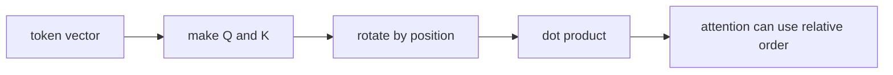

## Feed-Forward Network

After attention moves information between token positions, the feed-forward network transforms each position independently.

| What is done? | Why do it? |
| --- | --- |
| Expand each token vector into a wider hidden feature space. | Give the model many candidate features to test. |
| Apply a nonlinearity such as GeLU or ReLU. | Let the model gate features and represent nonlinear functions. |
| Project back to model width and add to the residual stream. | Write learned transformations back into the token state. |

Attention answers "which other positions should I read from?" The feed-forward network answers a different question: "given the information now present at this position, what local transformation or stored association should I apply?"

A standard transformer MLP has:

$$
\operatorname{FFN}(x) =
W_2\,\phi(W_1x + b_1) + b_2
$$

where $\phi$ is a nonlinearity such as ReLU or GeLU.

Read this in three steps:

1. $W_1x + b_1$ creates a wider list of candidate feature activations.
2. $\phi$ gates those activations, keeping some and suppressing others.
3. $W_2$ converts the active features back into the model's vector space.

For the GPT-2-like shape:

$$
768 \rightarrow 3072 \rightarrow 768
$$

This is a 4x expansion and projection back down.

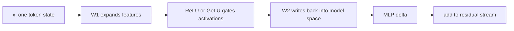

A useful intuition:

- $W_1$ detects features.
- The nonlinearity decides which detected features are active.
- $W_2$ writes learned directions back into the residual stream.

This is why the MLP is often described as memory-like. It contains many parameters and can store a lot of learned associations and transformations.

Tiny Python example with ReLU:

```python
import numpy as np

def relu(x):
    return np.maximum(0, x)

# Two-dimensional token state.
x = np.array([1.0, -2.0])

# Expand from 2 dimensions to 3 feature activations.
W1 = np.array([
    [ 1.0,  0.0,  1.0],
    [ 0.0,  1.0, -1.0],
])
b1 = np.array([0.0, 0.0, 0.0])

# Project from 3 features back to 2 dimensions.
W2 = np.array([
    [ 1.0,  0.0],
    [ 0.0,  1.0],
    [ 0.5, -0.5],
])
b2 = np.array([0.0, 0.0])

h = x @ W1 + b1
h_relu = relu(h)
delta = h_relu @ W2 + b2

print(h)       # [ 1. -2.  3.]
print(h_relu)  # [1. 0. 3.]
print(delta)   # [ 2.5 -1.5]
```

The negative feature was suppressed. The positive features were used to write a new vector. A real transformer MLP does this with thousands of intermediate features per token.

## ReLU And GeLU

ReLU is:

$$
\operatorname{ReLU}(x) = \max(0, x)
$$

Negative values become 0. Positive values pass through.

GeLU is smoother. One common approximation is:

$$
\operatorname{GeLU}(x)
\approx
0.5x\left(1 + \tanh\left(\sqrt{\frac{2}{\pi}}(x + 0.044715x^3)\right)\right)
$$

The key reason for a nonlinearity is that without it, a stack of linear transformations would collapse into one linear transformation. Nonlinear gates let the network represent more complex functions.

## FFN As Feature Detection And Knowledge Writing

Consider a toy color example. Suppose the vector for `red` contains features like:

| Feature | Activation |
| --- | ---: |
| color | 1.0 |
| warm | 0.8 |
| bright | -0.2 |
| saturated | 0.3 |

The first matrix can detect candidate features:

| Detected feature | Raw activation | After ReLU |
| --- | ---: | ---: |
| is color | 1.72 | 1.72 |
| is warm/red | 1.36 | 1.36 |
| is cool/blue | -0.41 | 0.00 |
| is saturated | 0.77 | 0.77 |
| has complement | 0.39 | 0.39 |

Then $W_2$ can write a direction associated with the complementary color back into the model space. The result might move the representation toward cyan-like features.

For language, the same idea becomes:

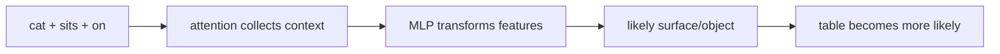

Attention gathers contextual information. The MLP transforms the current token state using learned feature logic.

## Weight Tying And The LM Head

The LM head converts the final hidden state back into vocabulary-token scores.

| What is done? | Why do it? |
| --- | --- |
| Compare the final hidden state against all token embeddings. | Convert an internal vector back into vocabulary-token scores. |
| Optionally reuse the input embedding table as output weights. | Save parameters and use the same token geometry for input and output. |
| Produce logits before softmax. | Keep raw scores flexible; probabilities are only needed at the final decision/loss step. |

The model begins with an embedding table:

$$
E \in \mathbb{R}^{V \times d}
$$

where $V$ is vocabulary size and $d$ is model width.

At the end, the hidden state $h$ is compared against token embeddings:

$$
\operatorname{logits} = hE^T
$$

This produces one logit per vocabulary token.

When the input embedding table and output head share weights, this is called weight tying. It saves parameters and makes conceptual sense: the same learned token vectors used to represent input tokens can also serve as output prototypes.

The final question is:

> Which token embedding is most aligned with the final hidden state?

## Logits, Final Softmax, And Sampling

At the end of the transformer:

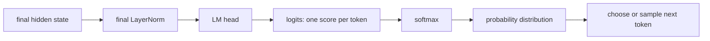

For Nanoschnack:

$$
1 \times 768 \rightarrow 1 \times 32000
$$

The model forward pass is deterministic if weights and inputs are fixed. Variation in chat output usually comes from the decoding step. Instead of always choosing the most likely token, the sampler can choose among likely tokens.

Small logits example:

```python
import numpy as np

vocab = ["table", "floor", "rocket"]
logits = np.array([3.0, 1.5, -1.0])

def softmax(x):
    x = x - np.max(x)
    exp_x = np.exp(x)
    return exp_x / exp_x.sum()

probs = softmax(logits)

for token, prob in zip(vocab, probs):
    print(token, round(float(prob), 3))

# table 0.806
# floor 0.180
# rocket 0.015
```

The logits are not probabilities. They do not need to be positive and they do not sum to 1. Softmax converts them into probabilities. If the correct next token is `table`, the loss is low. If the correct next token is `rocket`, the loss is high.

Common decoding options:

| Method | Behavior |
| --- | --- |
| Greedy | Always pick the highest-probability token |
| Temperature | Sharpen or flatten the probability distribution |
| Top-k | Sample only from the top $k$ tokens |
| Top-p | Sample from the smallest set whose total probability exceeds $p$ |

This is why the same prompt can produce different answers even when the model itself is deterministic.

## Loss

Training needs a number that says how wrong the model was.

| What is done? | Why do it? |
| --- | --- |
| Measure the probability assigned to the correct next token. | Training needs a scalar objective that rewards correct predictions. |
| Use negative log probability, or cross-entropy. | Confident wrong predictions are penalized strongly; confident correct predictions get low loss. |
| Average this over many tokens. | The model learns broad statistical structure rather than one example. |

For token prediction, the usual loss is cross-entropy:

$$
L = -\log p(y)
$$

where $p(y)$ is the predicted probability assigned to the correct next token $y$.

This formula has a nice intuition:

| Probability assigned to correct token | Loss $-\log(p)$ |
| ---: | ---: |
| 1.00 | 0.00 |
| 0.90 | 0.11 |
| 0.50 | 0.69 |
| 0.10 | 2.30 |
| 0.01 | 4.61 |

If the model is confident and correct, the loss is near zero. If the model gives the correct token low probability, the loss becomes large.

Example with three possible next tokens:

| Token | Probability |
| --- | ---: |
| `table` | 0.70 |
| `floor` | 0.20 |
| `rocket` | 0.10 |

If the true next token is `table`:

$$
L = -\log(0.70) \approx 0.36
$$

If the true next token is `rocket`:

$$
L = -\log(0.10) \approx 2.30
$$

Same model output, different target, different loss.

Python version:

```python
import numpy as np

probs = {
    "table": 0.70,
    "floor": 0.20,
    "rocket": 0.10,
}

def cross_entropy_for_target(target):
    return -np.log(probs[target])

print(cross_entropy_for_target("table"))   # 0.356...
print(cross_entropy_for_target("rocket"))  # 2.302...
```

In actual training, the model starts from logits, applies softmax, and then cross-entropy measures how much probability landed on the correct token. Libraries combine these steps in numerically stable functions.

A simpler squared-loss example helps build gradient intuition:

$$
y = wx
$$

with:

$$
x = 2,\quad w = 3,\quad y = 6,\quad \text{target} = 10
$$

The loss is:

$$
L = (y - 10)^2 = (6 - 10)^2 = 16
$$

The model is wrong because 6 is far from 10.

Squared loss is not the usual token-prediction loss, but it is excellent for learning gradients because the derivative is easy to see.

## Gradients

A gradient tells us how the loss changes when a parameter changes.

| What is done? | Why do it? |
| --- | --- |
| Compute the derivative of loss with respect to each parameter. | Find which direction changes would reduce error. |
| Move parameters opposite the gradient. | Reduce the loss for future examples. |
| Repeat over many batches. | Accumulate small improvements into learned structure. |

For one weight $W_{ij}$:

$$
\frac{\partial L}{\partial W_{ij}}
$$

Interpretation:

| Gradient | Meaning | Update intuition |
| ---: | --- | --- |
| positive | Increasing this weight increases loss | Make it smaller |
| negative | Increasing this weight decreases loss | Make it bigger |
| zero | This example does not care about this weight | Leave it mostly unchanged |

Gradient descent updates weights as:

$$
W_{ij} \leftarrow W_{ij} - \eta \frac{\partial L}{\partial W_{ij}}
$$

where $\eta$ is the learning rate.

Before using calculus, you can approximate a gradient by trying a tiny change. This is called a finite difference.

For:

$$
L(w) = (2w - 10)^2
$$

at $w=3$:

$$
L(3) = (6 - 10)^2 = 16
$$

Try increasing $w$ slightly to $3.01$:

$$
L(3.01) = (6.02 - 10)^2 = 15.8404
$$

The loss went down when $w$ went up. Therefore the gradient should be negative.

Python version:

```python
def loss(w):
    return (2 * w - 10) ** 2

w = 3.0
eps = 0.01

approx_gradient = (loss(w + eps) - loss(w)) / eps

print(loss(w))          # 16.0
print(loss(w + eps))    # 15.8404
print(approx_gradient)  # about -15.96, close to -16
```

Calculus gives the exact local value instead of the approximation.

For the toy example:

$$
L = (y - 10)^2,\quad y = wx
$$

Using the chain rule:

$$
\frac{dL}{dw}
=
\frac{dL}{dy}\frac{dy}{dw}
=
2(y - 10)x
=
2(6 - 10)2
=
-16
$$

The gradient is negative, so increasing $w$ reduces the loss.

One gradient-descent step with learning rate $\eta = 0.1$:

$$
w \leftarrow 3 - 0.1(-16) = 4.6
$$

The new prediction is:

$$
y = 4.6 \cdot 2 = 9.2
$$

The new loss is:

$$
L = (9.2 - 10)^2 = 0.64
$$

One step moved the model much closer to the target.

Python version:

```python
w = 3.0
x = 2.0
target = 10.0
lr = 0.1

y = w * x
grad = 2 * (y - target) * x
w = w - lr * grad

print(w)              # 4.6
print((w * x - target) ** 2)  # 0.64
```

## Backpropagation

Backpropagation is the systematic use of the chain rule through the whole computation graph.

| What is done? | Why do it? |
| --- | --- |
| Record how the forward pass was computed. | The model needs a graph to know how loss depends on each parameter. |
| Propagate gradients backward through each operation. | Each matrix learns how it contributed to the error. |
| Feed gradients to an optimizer. | Convert error signals into parameter updates. |

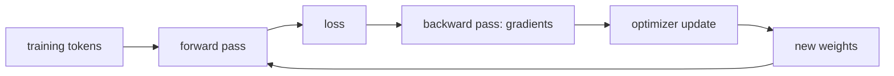

Every operation in the model is chosen to be differentiable or almost everywhere differentiable:

- Matrix multiply.
- Addition.
- LayerNorm.
- Softmax.
- Cross-entropy.
- ReLU/GeLU.

PyTorch can compute the derivatives automatically, but mathematically it is applying the chain rule across all operations.

A useful way to read backpropagation is: every operation receives an incoming gradient and passes an outgoing gradient to the values that produced it.

For the toy computation:

$$
w \rightarrow y = wx \rightarrow L = (y - 10)^2
$$

with $x=2$, $w=3$, and $y=6$:

| Step | Local derivative | Value |
| --- | --- | ---: |
| $L=(y-10)^2$ | $\frac{dL}{dy}=2(y-10)$ | $-8$ |
| $y=wx$ | $\frac{dy}{dw}=x$ | $2$ |
| Chain rule | $\frac{dL}{dw}=\frac{dL}{dy}\frac{dy}{dw}$ | $-16$ |

The large transformer is the same principle with many more operations and tensors. Instead of one scalar weight $w$, there are matrices with millions of entries. Instead of one path through the graph, there are many paths. Autograd systems keep track of those paths and add gradient contributions together.

Manual Python version:

```python
x = 2.0
w = 3.0
target = 10.0

# Forward pass
y = w * x
loss = (y - target) ** 2

# Backward pass by hand
dL_dy = 2 * (y - target)
dy_dw = x
dL_dw = dL_dy * dy_dw

print(loss)   # 16.0
print(dL_dw)  # -16.0
```

PyTorch version, if PyTorch is installed:

```python
import torch

x = torch.tensor(2.0)
w = torch.tensor(3.0, requires_grad=True)
target = torch.tensor(10.0)

y = w * x
loss = (y - target) ** 2
loss.backward()

print(w.grad)  # tensor(-16.)
```

When model code calls `loss.backward()`, it is doing this across the whole transformer graph: embeddings, projections, attention, softmax, MLPs, residual additions, normalization, and the final output head.

## Learning Rate

The learning rate controls how large the update step is.

| What is done? | Why do it? |
| --- | --- |
| Choose a step size for parameter updates. | Control how aggressively the model changes its weights in response to gradients. |
| Warm up from a small learning rate. | Avoid large chaotic updates when the model is still random and gradients can be unstable. |
| Decay the learning rate later. | Let training make broad improvements early, then settle into smaller refinements. |

If the learning rate is too high, training can become unstable or diverge. If it is too low, training may be painfully slow or get stuck making tiny improvements.

Practical training often uses a schedule:

- Start small during warmup.
- Increase to a peak learning rate.
- Decay over the rest of training.

The Nanoschnack training setup includes a token-driven schedule:

| Phase | Approximate share |
| --- | ---: |
| Warmup | 3% of target tokens |
| Cosine decay | 97% of target tokens |
| Minimum LR | about 10% of peak |

Using token count rather than just batch count matters because the training budget is fundamentally measured in tokens processed.

## The Training Data Pipeline

A small model still needs serious data plumbing. The Nanoschnack pipeline streams German text from several sources, tokenizes it, packs it into fixed-length blocks, and feeds it to the model.

| What is done? | Why do it? |
| --- | --- |
| Stream and prefetch dataset shards. | Keep the GPU fed without requiring all data in memory. |
| Tokenize text into IDs before training batches. | The transformer consumes token IDs, not raw text. |
| Pack tokens into fixed-length blocks. | Avoid padding waste and make tensor shapes efficient. |
| Interleave and shuffle sources. | Prevent the model from overfitting to one source's ordering or style. |

```mermaid
flowchart LR
  Sources["German text sources"] --> Shards["HF Parquet shards"]
  Shards --> Prefetch["shard prefetcher"]
  Prefetch --> Cache["local cache"]
  Cache --> Text["raw German text"]
  Text --> BPE["GPT-2 BPE tokenizer"]
  BPE --> IDs["token IDs + EOS"]
  IDs --> Pack["pack into 1024-token blocks"]
  Pack --> Interleave["interleave sources"]
  Interleave --> Shuffle["shuffle buffer"]
  Shuffle --> Loader["DataLoader"]
  Loader --> Queue["prefetch queue"]
  Queue --> Model["GPT-2-like model"]
```

Important engineering ideas:

- Stream data instead of loading everything into memory.
- Prefetch shards while the GPU is training.
- Tokenize with parallel workers.
- Concatenate token IDs and slice into fixed-length blocks.
- Avoid padding waste when possible.
- Interleave sources so one dataset does not dominate.
- Shuffle enough to prevent highly ordered batches.

Training is not only model code. The model learns only as fast and as cleanly as the data pipeline can feed it.

## Pretraining And Post-Training

Training is often divided into a broad pretraining phase and a more targeted post-training phase.

| What is done? | Why do it? |
| --- | --- |
| Train first on large general text. | Learn broad language, facts, syntax, formatting, and world patterns. |
| Then train on curated chat/instruction data. | Shape the base predictor into a useful assistant-like behavior. |
| Mask prompt loss during chat fine-tuning. | Teach the model to produce assistant answers, not to imitate the user prompt. |

Pretraining:

- Uses large general text.
- Optimizes next-token prediction.
- Teaches language, facts, style, code patterns, formatting, and broad statistical structure.

Post-training:

- Uses curated instruction/chat data.
- Teaches the model to follow roles and answer as an assistant.
- Often masks loss so the prompt is not graded, only the assistant answer.

Example chat-format sequence:

```text
<|SYSTEM|> Du bist... <|END|>
<|USER|> Frage <|END|>
<|ASSISTANT|> Antwort <|END|>
```

Example loss mask:

| Token region | Loss mask |
| --- | ---: |
| system prompt | 0 |
| user prompt | 0 |
| assistant answer | 1 |

The model still learns next-token prediction, but only assistant tokens contribute to the loss in this phase.

## Token Budget

Token budgeting asks how much training data a model size can use effectively.

| What is done? | Why do it? |
| --- | --- |
| Choose a target number of training tokens. | Match model size with enough data to use its capacity. |
| Relate tokens to parameter count. | Avoid training a large model on too little data or wasting compute on a model too small to absorb the data. |
| Track progress by tokens processed. | Tokens are the actual learning examples in next-token prediction. |

A Chinchilla-style rule of thumb is:

$$
\text{target training tokens} \approx 20 \times \text{parameter count}
$$

For a 124M-parameter model:

$$
124\text{M} \times 20 \approx 2.5\text{B tokens}
$$

This is a compute-optimality heuristic. If the model is too large for the token budget, it is undertrained. If the model is too small for the token budget, it may not use the available data efficiently.

## Parameter Breakdown

Breaking down the parameter count helps you see what the model is spending its capacity on.

| What is done? | Why do it? |
| --- | --- |
| Count parameters by component. | See where memory, capacity, and compute are spent. |
| Separate attention, FFN, embeddings, and normalization. | Understand which parts route information, transform features, or store token representations. |
| Compare per-block parameter counts. | Make architecture tradeoffs concrete instead of treating the model as one undifferentiated blob. |

For a GPT-2-like 124.5M-parameter model, an approximate breakdown is:

| Component | Parameters | Share |
| --- | ---: | ---: |
| FFN/MLP | 56.7M | 45.5% |
| Embedding table | 38.6M | 31.0% |
| Attention | 28.3M | 22.8% |
| LayerNorm | small | small |

Per transformer block:

| Component | Approximate parameters |
| --- | ---: |
| FFN | 4.72M |
| Attention | 2.36M |

The takeaway is important: attention gets much of the conceptual focus because it moves information between positions, but the feed-forward network is often larger and stores a large share of learned transformations.

## KV Caching

During inference, the model generates one token at a time. At step $t$, the new token needs to attend to all previous tokens.

| What is done? | Why do it? |
| --- | --- |
| Cache previous key and value tensors. | Old tokens do not change during causal generation, so their K/V projections are reusable. |
| Compute Q/K/V only for the new token. | Avoid recomputing the whole prefix at every generation step. |
| Let the new query attend over cached keys and values. | Preserve full-prefix attention while making inference much cheaper. |

Naively, every step would recompute keys and values for the full prefix. But previous tokens do not change. Their key and value projections can be cached.

The decisive detail is this:

> A token offers the same key and value to every future token.

For a source token $j$:

$$
k_j = x_jW_K,\quad v_j = x_jW_V
$$

These depend on token $j$'s own hidden state at that layer. They do not depend on the later token that will query them. The later token $i$ brings its own query:

$$
q_i = x_iW_Q
$$

The attention score is the part that depends on both:

$$
\operatorname{score}_{ij} = q_i \cdot k_j
$$

In models that use RoPE, the query and key are also position-rotated before the dot product. The value is not RoPE-rotated. For an old source token, its position is fixed, so its RoPE-adjusted key can be cached, or the cache can store enough information to reconstruct that positioned key efficiently. The new token's query is still computed and position-rotated at the current step.

So RoPE does not break KV caching. It just means the cache must respect this split:

| Object | RoPE? | Cache behavior |
| --- | --- | --- |
| Old key $k_j$ | yes, Q/K path | cache the positioned key or reconstruct it from cached components |
| Old value $v_j$ | no | cache directly |
| New query $q_i$ | yes, Q/K path | compute for the current token and current position |

That means:

| Part | Depends on | Cacheable? | Why |
| --- | --- | --- | --- |
| Old key $k_j$ | old token state $x_j$ | yes | token $j$ advertises the same match signal to all later tokens |
| Old value $v_j$ | old token state $x_j$ | yes | token $j$ sends the same payload whenever it is read |
| New query $q_i$ | new token state $x_i$ | no, compute now | the current token asks a new question |
| Score $q_i \cdot k_j$ | new query and old key | no, compute now | the match changes for each querying token |
| Softmax weights | all scores in the current row | no, compute now | each new query gets its own attention distribution |

This is why KV caching works but attention-weight caching does not. The old token's offer is static. The new token's question is dynamic.

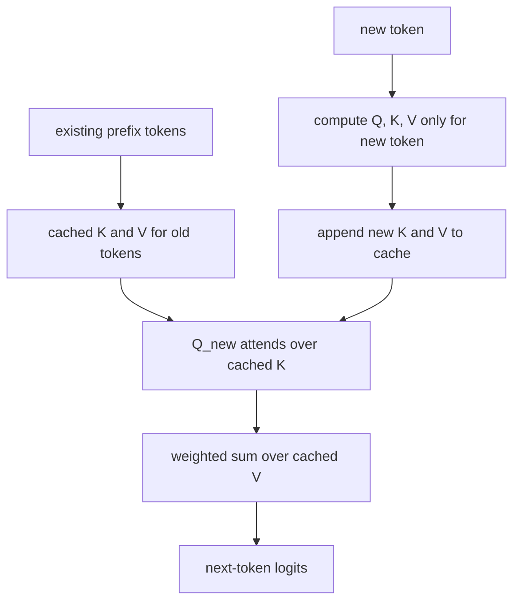

Another way to draw the attention cell for one new query is:

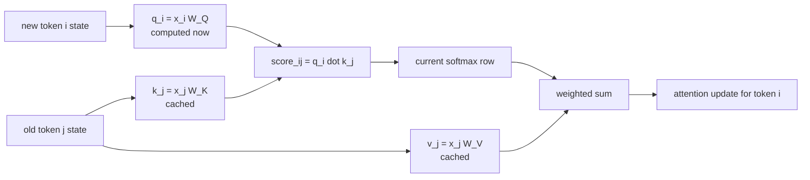

Why KV caching works:

- Causal attention only looks backward.
- Old tokens cannot be influenced by future tokens.
- Old keys and values are therefore reusable.
- The new token needs old K/V, but old token K/V do not need recomputation.

For one next-token step with a prefix of length $N$, a naive full-prefix forward pass would rebuild an $N \times N$ attention pattern. KV caching changes the work: for each layer, the model computes only the new row of attention, comparing the new query against the $N$ cached keys.

In big-O terms for the attention-score part of one next-token step:

$$
\text{without cache: } O(N^2)
$$

$$
\text{with KV cache: } O(N)
$$

The cache does not remove the need to compare the new token with the old tokens. It removes the waste of recomputing old token projections and old attention rows.

So for one new token:

| Approach | What happens for attention |
| --- | --- |
| No KV cache | Recompute K/V for the whole prefix and rebuild full attention work for the prefix. |
| KV cache | Compute the new token's Q/K/V, append its K/V, and compute only the new query's scores against cached K. |

Across a long generated answer, attention still grows with the generated length because every new token can read more previous tokens. KV caching does not make long-context generation free. It removes the wasteful part: recalculating static K/V and old attention rows.

Why it matters:

- It greatly speeds up autoregressive generation.
- It increases memory usage.
- Long-context inference becomes dominated by cache size and memory bandwidth.

## Training Is Parallel; Inference Is Sequential

| What is done? | Why do it? |
| --- | --- |
| During training, process all positions in a context block together. | Compute many next-token losses per forward pass and use GPU parallelism efficiently. |
| During inference, generate one new token at a time. | The next input depends on the token just sampled, so the full future sequence is not known yet. |
| Use KV caching during inference. | Reuse old key/value states so only the new token needs fresh attention projections. |

Training:

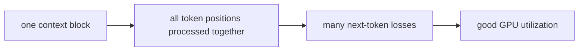

Inference:

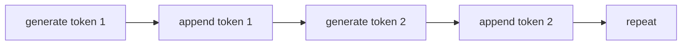

KV caching reduces repeated work, but the outer generation loop remains sequential.

## GPU Motivation

Transformers are dominated by dense linear algebra, which is exactly the kind of work GPUs are designed to accelerate.

| What is done? | Why do it? |
| --- | --- |
| Express model work as matrix multiplications and tensor operations. | GPUs are built to run many parallel multiply-add operations efficiently. |
| Batch work across tokens and examples. | Large parallel batches keep GPU cores busy. |
| Optimize memory movement as much as arithmetic. | At LLM scale, moving tensors can be more expensive than computing with them. |

Common operations include:

- Embedding lookups.
- Q/K/V projections.
- Attention score matrices.
- Attention output projections.
- MLP up projections.
- MLP down projections.
- LM head projection.
- Backward pass computations for all of the above.

GPUs are good at:

- Many parallel multiply-add operations.
- Matrix multiplications.
- Batched operations.
- High memory bandwidth.

The math can be implemented in a few hundred lines of Python for learning. Making it fast is a systems problem.

## CUDA, Kernels, And Memory Movement

CUDA is NVIDIA's programming platform for GPUs. A CUDA kernel is a function launched on the GPU across many threads.

| What is done? | Why do it? |
| --- | --- |
| Run tensor operations as GPU kernels. | Execute the same operation over many values in parallel. |
| Use shared memory/registers when possible. | Avoid slow global-memory traffic. |
| Fuse neighboring operations. | Reduce kernel launches and intermediate writes. |

The performance issue is not only arithmetic. Memory movement often dominates.

GPU memory hierarchy, simplified:

| Memory | Size | Speed |
| --- | --- | --- |
| Global memory | large | slowest |
| Shared memory / SRAM | small | faster |
| Registers | tiny | fastest |

A naive implementation may write intermediate tensors to global memory, launch another kernel, read them back, and repeat. Each launch has overhead, and global memory traffic is expensive.

The optimization direction is:

- Fuse operations.
- Keep values in registers or shared memory.
- Avoid materializing huge intermediate matrices.
- Use optimized kernels instead of naive Python-level compositions.

## Softmax Overflow

Softmax uses exponentials, so numerical stability matters.

| What is done? | Why do it? |
| --- | --- |
| Subtract the maximum score before exponentiating. | Keep the largest exponent at $\exp(0)=1$ and avoid floating-point overflow. |
| Use the shifted scores inside the same softmax formula. | Preserve the exact probability distribution while making the computation numerically stable. |

The exponential operation is:

$$
\exp(x)
$$

In float32, large inputs can overflow:

| Expression | Approximate value |
| --- | ---: |
| $\exp(50)$ | $5 \times 10^{21}$ |
| $\exp(89)$ | $4 \times 10^{38}$ |
| $\exp(90)$ | infinity in float32 |

Stable softmax subtracts the maximum:

$$
\operatorname{softmax}(x_i) =
\frac{\exp(x_i - \max(x))}
{\sum_j \exp(x_j - \max(x))}
$$

This is mathematically equivalent because the same factor cancels from numerator and denominator. Now the largest exponent is:

$$
\exp(0) = 1
$$

which avoids overflow.

## Parallel Reduction

Softmax needs reductions, which means it needs aggregate values computed across a row.

| What is done? | Why do it? |
| --- | --- |
| Find row maxima and row sums using parallel reductions. | Softmax needs aggregate values, and GPUs compute those efficiently with many threads. |
| Reduce in a tree-like pattern. | Turn a long serial loop into logarithmic parallel work. |
| Combine reductions with stable softmax. | Make attention both fast and numerically safe. |

The core steps are:

1. Find the maximum.
2. Sum exponentials.
3. Divide by the sum.

On a GPU, reductions are done in parallel. A tree reduction for 8 values looks like:

```mermaid
flowchart TD
  A["8 values"] --> B["4 pairwise maxima"]
  B --> C["2 pairwise maxima"]
  C --> D["1 maximum"]
```

This takes $O(\log n)$ reduction steps rather than $O(n)$ serial steps.

## FlashAttention

Standard attention appears to require a large score matrix.

| What is done? | Why do it? |
| --- | --- |
| Tile attention computation into smaller blocks. | Work on chunks that fit in fast memory. |
| Use online softmax. | Avoid storing the full $N \times N$ score matrix. |
| Fuse score, softmax, and value accumulation. | Reduce global-memory traffic and improve long-context feasibility. |

The score matrix is:

$$
QK^T
$$

For sequence length $N$, that is an $N \times N$ matrix. For long contexts, this matrix becomes enormous.

FlashAttention reorganizes attention so the full attention matrix is not materialized in global memory.

```mermaid
flowchart LR
  QKV["Q, K, V blocks"] --> Tile["tile into SRAM/shared memory"]
  Tile --> Scores["compute partial QK^T"]
  Scores --> Online["online stable softmax"]
  Online --> Accum["accumulate output times V"]
  Accum --> Out["write final attention output"]
```

The conceptual attention operation remains the same. The implementation changes where intermediate values live and when they are computed.

Summary:

| Standard attention | FlashAttention |
| --- | --- |
| May materialize $N \times N$ attention matrix | Avoids materializing full matrix |
| More global memory traffic | More work stays in fast memory |
| Simpler conceptually | More complex kernel |
| Memory grows badly for long contexts | Much better memory behavior |

## Kernel Fusion

| What is done? | Why do it? |
| --- | --- |
| Combine several neighboring tensor operations into one GPU kernel. | Avoid repeated kernel launches and global-memory round trips. |
| Keep intermediate values in registers or fast memory. | Reduce bandwidth pressure, which is often the limiting factor. |
| Use fused kernels for common transformer patterns. | Make the same math run faster without changing the model's behavior. |

Unfused operations:

```mermaid
flowchart LR
  A["Multiply"] --> W1["write memory"]
  W1 --> B["Add"]
  B --> W2["write memory"]
  W2 --> C["GeLU"]
  C --> W3["write memory"]
```

Fused operation:

```mermaid
flowchart LR
  X["input"] --> F["Multiply + Add + GeLU in one kernel"]
  F --> Y["output"]
```

Benefits:

- Fewer kernel launches.
- Less global memory traffic.
- More values can stay in registers.
- Better GPU utilization.

FlashAttention is an extreme form of fusion for the attention pattern:

$$
QK^T \rightarrow \text{scale} \rightarrow \text{online softmax} \rightarrow V
$$

inside one optimized tiled kernel.

## CUDA Graphs

Kernel fusion reduces the number of kernels. CUDA graphs reduce launch overhead for the remaining kernels.

| What is done? | Why do it? |
| --- | --- |
| Capture a repeated sequence of GPU operations. | The CPU does not need to issue every small kernel launch separately each time. |
| Replay the captured graph. | Reduce launch overhead for repeated shapes and common inference loops. |
| Keep the computation graph predictable. | Make serving latency more stable when requests use compatible shapes. |

Without CUDA graphs:

```mermaid
sequenceDiagram
  participant CPU
  participant GPU
  CPU->>GPU: launch kernel 1
  CPU->>GPU: launch kernel 2
  CPU->>GPU: launch kernel 3
  CPU->>GPU: launch kernel ...
```

With CUDA graphs:

```mermaid
sequenceDiagram
  participant CPU
  participant GPU
  CPU->>GPU: capture kernel sequence once
  CPU->>GPU: replay graph with one launch
```

The practical theme is the same: the model is linear algebra, but performance is about arranging that linear algebra so the GPU stays busy and memory movement is minimized.

## Precision And Data Size

Using fewer bytes per number reduces memory footprint and memory bandwidth.

| What is done? | Why do it? |
| --- | --- |
| Store and compute many tensors in FP16 or BF16 instead of FP32. | Use less memory, move fewer bytes, and run faster on modern tensor cores. |
| Keep numerically sensitive operations stable. | Prevent overflow, underflow, or training instability. |
| Choose precision by phase and hardware. | Training, inference, GPUs, and kernels have different stability and throughput constraints. |

| Type | Bytes per value | Why use it |
| --- | ---: | --- |
| FP32 | 4 | Stable, broad range |
| FP16 | 2 | Faster and smaller, but less range |
| BF16 | 2 | Better range than FP16, common for training |

At LLM scale, halving bytes per value can be enormous. It affects activations, weights, gradients, optimizer state, KV cache size, and communication between devices.

The tradeoff is numerical stability. Training systems use careful initialization, normalization, loss scaling, BF16, mixed precision, and stable kernels to keep values usable.

## Long Contexts

Long-context design starts with a simple problem: naive attention memory scales quadratically.

| What is done? | Why do it? |
| --- | --- |
| Increase the number of tokens the model can see. | Let later tokens use more distant instructions, documents, examples, and conversation history. |
| Avoid materializing impossible $N \times N$ attention tensors. | Dense attention grows quadratically and quickly exceeds memory limits. |
| Use kernels, caching, compression, sparsity, or architecture changes. | Preserve useful long-range information while controlling memory and bandwidth cost. |

The scaling is:

$$
O(N^2)
$$

For $N = 1{,}000{,}000$ tokens:

$$
N^2 = 10^{12}
$$

That is far too large to store as a dense attention matrix in ordinary GPU memory.

Long-context systems rely on combinations of:

- Optimized exact attention kernels.
- KV caching.
- Compression.
- Sparse or local attention patterns.
- Recurrence-like mechanisms.
- Latent attention.
- Architectural changes.

The conceptual goal remains: let relevant earlier information affect later tokens. The engineering challenge is doing it without impossible memory traffic.

## Mixture Of Experts

Mixture of Experts, or MoE, replaces one dense MLP with many expert MLPs and a router.

| What is done? | Why do it? |
| --- | --- |
| Replace a single dense FFN with many expert FFNs. | Increase total model capacity without running every parameter for every token. |
| Route each token to a small number of experts. | Spend compute only on the experts that the router thinks are useful for that token. |
| Train routing and experts together. | Let specialization emerge from the prediction objective rather than hand-assigning topics. |

```mermaid
flowchart LR
  X["token state"] --> Router["router"]
  Router --> E1["expert 1"]
  Router --> E2["expert 2"]
  Router --> E3["expert 3"]
  Router --> EN["expert N"]
  E1 --> Mix["weighted sum of selected experts"]
  E2 --> Mix
  E3 --> Mix
  EN --> Mix
  Mix --> Out["MLP delta"]
```

Usually only a small number of experts run for each token. This allows a model to have many parameters without activating all of them for every token.

Benefits:

- Larger total parameter count.
- Lower active compute per token than a dense model of the same total size.
- Possible specialization across experts.

Costs:

- Routing complexity.
- Load balancing problems.
- Communication overhead across GPUs or nodes.
- More complex training and serving.

MoE is not a different species of model. It is a change to the feed-forward part of the transformer block.

## DeepSeek-Style Latent Attention

Standard KV caching stores key/value tensors for every layer, head, token, and batch item. Long contexts make that memory large.

Multi-head latent attention, associated with DeepSeek-style models, compresses parts of the K/V state into a smaller latent representation.

A latent representation is a small internal representation that is not directly the thing you need, but contains enough information to reconstruct the thing you need later. In this case, the cache does not store full per-head K/V tensors. It stores a compact latent vector from which the model can reconstruct the needed keys and values.

You can read the normal-versus-MLA picture as a left/right comparison: the normal path caches expanded per-head K/V, while the MLA path compresses once into a shared latent space, caches that latent representation, then decompresses or reconstructs per-head K/V when attention is computed.

| What is done? | Why do it? |
| --- | --- |
| Store a compressed latent representation instead of full K/V tensors. | Reduce cache memory and memory bandwidth during long-context inference. |
| Reconstruct or project the needed attention information from the latent state. | Keep attention behavior useful while changing the storage format. |
| Trade extra projection work for smaller cache movement. | Serving is often limited by memory movement, not just arithmetic. |
| Keep a small RoPE positional component outside the compressed content path. | Preserve clean positional matching instead of forcing position information through the same compression bottleneck. |

```mermaid
flowchart LR
  X["hidden state x_t"] --> Down["down-project to latent c_t"]
  X --> RopeK["small RoPE key part"]
  Down --> Cache["KV cache stores c_t"]
  RopeK --> CacheR["cache positional key part"]
  Cache --> UpK["reconstruct K content per head"]
  Cache --> UpV["reconstruct V per head"]
  CacheR --> Scores["attention scores"]
  UpK --> Scores
  Q["new query content + RoPE query"] --> Scores
  Scores --> Softmax["softmax weights"]
  UpV --> Mix["weighted value sum"]
  Softmax --> Mix
```

The important phrase is:

> KV-cache compression by construction.

This is not an after-the-fact compression algorithm applied to an ordinary cache. The architecture is designed so the thing that enters the cache is already small.

In a DeepSeek-V3-style configuration, the hidden state is projected down from a large model width into a much smaller latent space:

$$
7168 \rightarrow 512
$$

That 512-dimensional latent is cached. Later, learned up-projections reconstruct the K/V information needed by the attention heads.

### Why RoPE Is Kept Separate

RoPE affects the geometry of query-key matching. It tells attention not only "does this content match?" but also "does this content match at this relative position?"

If all positional information were forced through the same compressed latent vector as content, the model would have to preserve content and position through one bottleneck. MLA-style designs keep a small positional component outside that compressed content path. In the example dimensions:

$$
512 \text{ latent dimensions} + 64 \text{ RoPE dimensions} = 576 \text{ cached dimensions}
$$

The mental model is:

| Path | What it stores | Why |
| --- | --- | --- |
| Latent content path | compressed information for reconstructing K/V content | saves cache memory |
| RoPE path | small positional key component | keeps relative-position matching clean |
| Query path | current token's query content and positional query | computed for the current token because the question changes |

### Back-Of-Envelope Cache Math

For ordinary per-head KV caching, a token may need to store K and V for every head. With example dimensions:

$$
128 \times (192 + 128) = 40960
$$

That means 128 heads, with 192 key dimensions and 128 value dimensions per head.

With the latent layout:

$$
512 + 64 = 576
$$

So the per-token cache size for that layer is reduced by:

$$
\frac{40960}{576} \approx 71.1
$$

Tiny Python check:

```python
heads = 128
d_key = 192
d_value = 128
latent = 512
rope = 64

standard_cache_dims = heads * (d_key + d_value)
mla_cache_dims = latent + rope

print(standard_cache_dims)              # 40960
print(mla_cache_dims)                   # 576
print(standard_cache_dims / mla_cache_dims)  # 71.111...
```

This is why MLA matters for inference economics. Long-context serving is often dominated by KV-cache memory pressure and memory bandwidth. A 71x reduction in cached dimensions per token is not a small implementation detail; it changes how expensive long contexts are to serve.

The tradeoff is that the model must reconstruct useful per-head K/V information from the latent representation. The latent must be:

- small enough to reduce cache cost,
- large enough to preserve the information attention needs,
- learned jointly with the rest of the model so compression and reconstruction become useful.

### Standard KV Cache Versus MLA Cache

```mermaid
flowchart TB
  subgraph Standard["Standard multi-head KV cache"]
    SX["token hidden state"] --> SK["K for head 1...H"]
    SX --> SV["V for head 1...H"]
    SK --> SCache["cache full per-head K"]
    SV --> SCache2["cache full per-head V"]
  end

  subgraph MLA["Multi-head latent attention cache"]
    MX["token hidden state"] --> MC["compressed latent c_t"]
    MX --> MR["small RoPE key part"]
    MC --> MCache["cache latent"]
    MR --> MRCache["cache RoPE part"]
    MCache --> MK["reconstruct K per head when needed"]
    MCache --> MV["reconstruct V per head when needed"]
  end
```

The standard cache stores the expanded per-head result. MLA stores a compact shared representation and reconstructs the per-head result later.

The purpose is systems efficiency:

- Smaller cache.
- Less memory movement.
- Better long-context serving.

The high-level attention goal is the same. The representation of cached information changes.

## API Mental Model

An API hides the internals, but the same sequence model is underneath.

| What is done? | Why do it? |
| --- | --- |
| Convert structured messages into a token sequence. | The transformer consumes tokens, not JSON objects or chat bubbles. |
| Run repeated forward passes and sampling. | Produce text by extending the sequence one token at a time. |
| Convert output tokens back into user-visible text or structured results. | Bridge the model's token-level computation to the API user's application. |

Example request shape:

```text
POST https://api.openai.com/v1/responses
```

```json
{
  "model": "gpt-5",
  "input": [{
    "role": "user",
    "content": [
      { "type": "text", "text": "The cat sits on the" }
    ]
  }]
}
```

Conceptually:

```mermaid
flowchart LR
  API["API request"] --> Format["chat formatting"]
  Format --> Tokens["tokenization"]
  Tokens --> Model["transformer forward passes"]
  Model --> Sampling["sampling"]
  Sampling --> Detok["detokenization"]
  Detok --> Response["response text"]
```

The API user sees messages. The model sees a token sequence with role/control tokens.

## Chat Formatting

A chat prompt is serialized into tokens.

| What is done? | Why do it? |
| --- | --- |
| Insert role and boundary markers into the token stream. | Tell the model which text is system instruction, user input, assistant output, or tool result. |
| Continue generation from the assistant position. | Condition the next-token predictor to produce the assistant side of the conversation. |
| Train on similarly formatted examples. | Make the formatting meaningful to the model instead of just decorative text. |

A simplified internal shape might look like:

```text
<|start|>system
You are ChatGPT...
<|end|>

<|start|>user
The cat sits on the
<|end|>

<|assistant|>
```

The model then continues with assistant tokens:

```text
table in the living room.
```

Chat models are still sequence models. Roles and messages are represented in the token stream.

## Claw64 Side Material

Claw64 is a side project involving a Commodore 64, a bridge, serial protocol, tool calls, screen scraping, and an agentic loop.

This is not core transformer theory, but it connects LLMs to systems integration. An agent is not only a model. It is a loop around a model.

| What is done? | Why do it? |
| --- | --- |
| Put the model inside a tool-using loop. | Real applications need to read state, call tools, execute actions, and return results. |
| Define explicit message frames and protocol states. | Keep unreliable external systems understandable and debuggable. |
| Send tool results back into the model context. | Let the next model step condition on what actually happened outside the model. |

```mermaid
sequenceDiagram
  participant User
  participant Bridge
  participant C64
  participant LLM
  User->>Bridge: message
  Bridge->>C64: MSG frame
  C64->>Bridge: LLM request
  Bridge->>LLM: API call
  LLM-->>Bridge: tool call
  Bridge->>C64: EXEC frame
  C64-->>Bridge: RESULT frame
  Bridge->>LLM: tool result
  LLM-->>Bridge: final text
  Bridge-->>User: answer
```

Frame types in the protocol include:

| Type | Meaning |
| --- | --- |
| `MSG` | user message |
| `LLM` | request model call |
| `EXEC` | execute command |
| `SCREENSHOT` | capture screen |
| `RESULT` | tool result |
| `TEXT` | final text |
| `STATUS` | runtime state |
| `ACK` | acknowledgement |

The point is that tool-using systems need transport, state, retries, framing, memory, and execution boundaries. The model is one component in a larger loop.

## Hyperparameters

Hyperparameters are choices made before training. They are not learned directly by gradient descent.

| What is done? | Why do it? |
| --- | --- |
| Choose architecture constants before training. | Define the model's capacity, memory use, and compute cost. |
| Choose optimization constants before training. | Control training stability, speed, and final quality. |
| Compare hyperparameter choices empirically. | Many tradeoffs cannot be decided from theory alone at practical scale. |

Examples:

| Hyperparameter | What it affects |
| --- | --- |
| Vocabulary size | Tokenization, embedding table size, output logits |
| Model width | Representation capacity and compute |
| Number of layers | Depth of computation |
| Number of heads | Parallel attention relation spaces |
| Context length | Maximum visible prefix |
| Batch size | GPU utilization and optimization behavior |
| Learning rate | Update step size |
| Warmup duration | Early training stability |
| MLP expansion factor | FFN capacity |
| Dropout/regularization | Overfitting and robustness |

Changing hyperparameters changes quality, compute cost, memory use, and training dynamics. Often the only way to know whether a choice is better is to train and compare.

## Why The Model Can Learn Useful Behavior

The model is trained on huge numbers of examples of this shape:

$$
\text{context} \rightarrow \text{next token}
$$

| What is done? | Why do it? |
| --- | --- |
| Optimize next-token prediction across many contexts. | Force the model to exploit any pattern that helps predict text. |
| Use a flexible architecture with attention, MLPs, and residual state. | Give the model enough machinery to represent syntax, facts, formatting, and algorithms. |
| Update weights through gradients from loss. | Turn prediction mistakes into parameter changes that improve future predictions. |

To reduce loss, it must exploit patterns:

- Syntax.
- Semantics.
- Facts.
- Style.
- Formatting.
- Code structure.
- Conversation patterns.
- Repeated reasoning traces in data.

It does not receive explicit symbolic rules. It receives pressure to predict. The internal vector machinery becomes a compressed statistical and functional model of the training distribution.

The two central questions are:

1. Can the architecture represent useful algorithms and patterns?
2. Can gradient-based training find parameters that implement those patterns?

The transformer architecture gives the model the machinery. The data and optimization process shape how that machinery is used.

## What "Understanding" Means Here

This tutorial avoids the philosophical claim that LLMs understand like humans.

| What is done? | Why do it? |
| --- | --- |
| Define understanding operationally. | Keep the explanation tied to observable model behavior and internal computation. |
| Describe the model as a learned context-to-distribution function. | Avoid vague claims while still explaining why useful behavior can emerge. |
| Separate capability from human-like experience. | A model can encode and use patterns without having human consciousness or perception. |

Operationally:

> An LLM has learned a function that maps token contexts to probability distributions over next tokens. Inside that function, it builds high-dimensional intermediate representations that encode useful information about the context.

That operational definition explains many visible behaviors:

- Translation-like behavior.
- Code completion.
- Question answering.
- Style imitation.
- Summarization.
- Tool-call formatting.
- Multi-step patterns when prompted or trained appropriately.

It does not require pretending that every internal feature is human-interpretable.

## The Minimal Mathematical Skeleton

| What is done? | Why do it? |
| --- | --- |
| Write the whole model as a chain of equations. | Show that the transformer is not magic; it is a sequence of vector and matrix operations. |
| Keep only the main operations. | Make the computation traceable before adding engineering details such as batching, caching, and optimized kernels. |
| Separate forward computation from training updates. | Clarify the difference between producing logits and changing weights. |

Start with token IDs:

$$
t_0, t_1, \ldots, t_n
$$

Embed them:

$$
x_i = E[t_i]
$$

For each transformer block:

$$
h = \operatorname{LayerNorm}(x)
$$

$$
Q = hW_Q,\quad K = hW_K,\quad V = hW_V
$$

Apply RoPE to $Q$ and $K$ when using rotational position encoding:

$$
Q' = RQ,\quad K' = RK
$$

Compute attention:

$$
S = \frac{Q'K'^T}{\sqrt{d_{\text{head}}}}
$$

$$
S = \operatorname{causal\_mask}(S)
$$

$$
A = \operatorname{softmax}(S)
$$

$$
\operatorname{attn} = AV
$$

Update the residual stream:

$$
x = x + \operatorname{attn}W_O
$$

Run the feed-forward network:

$$
h = \operatorname{LayerNorm}(x)
$$

$$
\operatorname{mlp} = W_2\phi(W_1h + b_1) + b_2
$$

$$
x = x + \operatorname{mlp}
$$

At the end:

$$
h = \operatorname{LayerNorm}(x)
$$

$$
\operatorname{logits} = hE^T
$$

$$
\operatorname{probs} = \operatorname{softmax}(\operatorname{logits})
$$

Training:

$$
L = \operatorname{cross\_entropy}(\operatorname{logits}, \text{target next token})
$$

$$
\nabla L = \operatorname{backprop}(L)
$$

$$
\theta \leftarrow \operatorname{optimizer\_update}(\theta, \nabla L)
$$

This is the conceptual loop.

Here is a tiny NumPy version of the forward-path idea. The dimensions are deliberately tiny:

- Vocabulary size: 5.
- Model width: 4.
- Sequence length: 3.
- One attention head with head size 2.

```python
import numpy as np

np.random.seed(0)

def softmax_rows(x):
    x = x - np.max(x, axis=-1, keepdims=True)
    exp_x = np.exp(x)
    return exp_x / exp_x.sum(axis=-1, keepdims=True)

# Tiny token sequence, e.g. ["the", "cat", "sits"].
tokens = np.array([0, 1, 2])

vocab_size = 5
d_model = 4
d_head = 2

# Learned parameters in a real model. Random here.
E = np.random.randn(vocab_size, d_model) * 0.1
W_Q = np.random.randn(d_model, d_head) * 0.1
W_K = np.random.randn(d_model, d_head) * 0.1
W_V = np.random.randn(d_model, d_head) * 0.1
W_O = np.random.randn(d_head, d_model) * 0.1

# 1. Embedding lookup: token IDs -> vectors.
x = E[tokens]  # shape: (T, d_model)

# 2. Project into query, key, value spaces.
Q = x @ W_Q  # shape: (T, d_head)
K = x @ W_K
V = x @ W_V

# 3. Attention scores.
scores = (Q @ K.T) / np.sqrt(d_head)  # shape: (T, T)

# 4. Causal mask.
mask = np.triu(np.ones_like(scores, dtype=bool), k=1)
scores[mask] = -np.inf

# 5. Attention weights and weighted values.
A = softmax_rows(scores)
attn = A @ V

# 6. Write attention result back into model width and add residual.
x = x + attn @ W_O

# 7. Final logits using tied embedding matrix.
logits = x @ E.T  # shape: (T, vocab_size)

print(x.shape)       # (3, 4)
print(logits.shape)  # (3, 5)
```

This code omits LayerNorm, MLP, RoPE, multiple heads, batching, and training. Still, it shows the spine of the computation:

$$
\text{IDs} \rightarrow E[t] \rightarrow Q,K,V \rightarrow \operatorname{softmax}(QK^T)V \rightarrow \text{logits}
$$

KV caching and MLA do not change this conceptual spine. They change what gets reused and how it is represented in memory during inference. Standard KV caching reuses expanded K/V tensors. MLA stores a smaller latent representation and reconstructs K/V-like information when attention needs it.

## Design Rationale Summary

The transformer is easier to remember if each part is tied to the problem it solves:

| Mechanism | What is done | Why it exists |
| --- | --- | --- |
| Tokenization | Convert text into token IDs. | Give arbitrary text a finite discrete interface the model can process. |
| Embeddings | Map each token ID to a learned vector. | Turn discrete symbols into continuous coordinates where similarity and learned transformations are possible. |
| Projections | Multiply hidden states by learned matrices, often into smaller spaces. | Create specialized views and keep dot products and cached vectors affordable. |
| Q/K/V attention | Build separate request, address, and payload vectors. | Let tokens decide what to read, from where, and what information to receive. |
| Causal mask | Hide future positions before softmax. | Train on full blocks in parallel without leaking the answer. |
| Softmax | Normalize scores into weights. | Turn arbitrary numbers into controlled mixtures or probabilities. |
| Multi-head attention | Run several attention mechanisms in parallel. | Let the model track different relations at the same time. |
| Residual stream | Add updates into a running token state. | Preserve information while layers gradually refine it. |
| LayerNorm | Normalize each token vector's scale. | Keep optimization stable across many layers. |
| RoPE | Rotate query/key pairs by position. | Make attention aware of relative order without storing position as plain text. |
| FFN/MLP | Transform each token position independently. | Detect, combine, and write learned features after attention has moved information. |
| LM head | Compare final states to token embeddings. | Convert hidden states into scores for possible next tokens. |
| Loss and backpropagation | Measure prediction error and send gradients backward. | Turn mistakes into weight updates. |
| Learning rate schedule | Control update size over training. | Balance fast learning with stability and late-stage refinement. |
| KV caching | Reuse old keys and values during generation. | Avoid recomputing unchanged prefix states. |
| Latent attention | Cache a compact latent representation and reconstruct K/V when needed. | Reduce KV-cache memory pressure by changing the architecture, not by compressing after the fact. |
| FlashAttention and fusion | Reorganize kernels and memory movement. | Keep the same math but make it feasible and fast on GPUs. |

## What To Memorize

Memorize these shapes:

| Object | Shape |
| --- | --- |
| Token ID | scalar integer |
| Token embedding | $1 \times 768$ |
| Sequence state | $T \times 768$ |
| One attention head projection | $768 \rightarrow 64$ |
| Attention scores | $T \times T$ |
| Attention output per head | $T \times 64$ |
| Concatenated heads | projected back to $T \times 768$ |
| MLP | $768 \rightarrow 3072 \rightarrow 768$ |
| LM head | $768 \rightarrow \text{vocab size}$ |

Memorize these equations:

$$
q = xW_Q,\quad k = xW_K,\quad v = xW_V
$$

$$
\operatorname{score}_{ij} = \frac{q_i \cdot k_j}{\sqrt{d_{\text{head}}}}
$$

$$
a_i = \operatorname{softmax}(\operatorname{score}_i)
$$

$$
\Delta_i = \sum_j a_{ij}v_j
$$

$$
x \leftarrow x + \operatorname{attention\_delta}
$$

$$
x \leftarrow x + \operatorname{mlp\_delta}
$$

$$
\operatorname{logits} = xE^T
$$

Memorize these concepts:

- Tokenization turns text into model-visible units.
- Embeddings are learned coordinates.
- Similar concepts tend to point in similar directions.
- Dot products measure alignment.
- Matrix multiplication computes many dot products at once.
- Attention moves information between token positions.
- The MLP transforms information inside each token position.
- The residual stream accumulates state.
- LayerNorm keeps values stable.
- Softmax turns arbitrary scores into weights or probabilities.
- Backpropagation trains the matrices.
- GPU performance is mostly about parallel math and memory movement.

## Common Confusions

### Does attention store facts?

Attention mostly routes information between token positions. The MLP contains a large fraction of parameters and is often described as storing knowledge. But real facts and behaviors are distributed across embeddings, attention, MLPs, residual streams, and layer interactions.

### Does the model know words?

It knows tokens. A human word may be one token, several tokens, or part of a token.

### Does the model read left to right?

During inference, yes, generation proceeds left to right. During training, the whole block is processed in parallel, but causal masking enforces left-to-right information flow.

### Is attention all you need?

Attention is central for routing between positions. But embeddings, MLPs, residuals, normalization, positional encoding, data, optimization, and hardware kernels are also essential.

### Why do we need position if tokens are already in order?

A matrix of token vectors does not automatically encode order in the way attention needs. Positional encoding gives the model a usable signal for relative and absolute position.

### Why not use one giant attention head?

Multiple heads let the model learn several relation spaces in parallel. One head might be useful for local adjacency, another for syntax, another for repeated tokens, and another for long-range references.

### Why is softmax everywhere?

Softmax turns arbitrary scores into normalized weights. It appears in attention and in final token probabilities.

### Why does German make tokenization harder?

German compounds, capitalization, morphology, and spacing patterns can split meaning across more subword pieces. More tokens per idea means more context use and more compute.

### Are LLMs probabilistic?

The neural network forward pass is deterministic for fixed weights and fixed input. Randomness usually enters during sampling, when the system chooses from the probability distribution instead of always taking the top token.

## Practical Forward Pass

| What is done? | Why do it? |
| --- | --- |
| Run the trained model once on the current token sequence. | Produce logits for the next-token distribution. |
| Move information through attention and MLP layers. | Convert raw token context into a context-aware final state. |
| Read the final position's logits. | In generation, the next token is predicted from the last visible position. |

Suppose the input is:

```text
The cat sits on the
```

The forward pass is:

1. Tokenizer converts text into IDs.
2. Embedding table maps IDs to vectors.
3. The model has one vector per token position.
4. Attention lets later positions receive information from earlier positions.
5. Causal masks prevent future leakage.
6. Multiple heads move different kinds of information.
7. MLPs transform each position's state.
8. Residual connections accumulate changes.
9. Final LayerNorm stabilizes output.
10. LM head compares the final state to token embeddings.
11. Logits become probabilities.
12. The model assigns high probability to tokens such as `table`.

## Practical Training Loop

Training is a repeated correction loop.

| What is done? | Why do it? |
| --- | --- |
| Compare predicted logits to the actual next tokens. | Get a numerical signal for how wrong the model was. |
| Backpropagate loss through the whole computation graph. | Discover which weights contributed to the error. |
| Update weights with an optimizer. | Make the next similar prediction slightly better. |

The loop is:

```mermaid
flowchart TD
  Load["load text"] --> Tok["tokenize"]
  Tok --> Pack["pack into context blocks"]
  Pack --> Forward["forward pass"]
  Forward --> Compare["compare logits to actual next tokens"]
  Compare --> Loss["compute loss"]
  Loss --> Backward["backpropagate gradients"]
  Backward --> Update["update weights"]
  Update --> Load
```

At the beginning, weights are random and predictions are bad. After many tokens, weights contain structure because every update pushed the model toward better next-token prediction.

## Practical Inference Loop

Inference is a repeated sequence-extension loop.

| What is done? | Why do it? |
| --- | --- |
| Encode the prompt and run the model. | Get a probability distribution for the next token. |
| Sample or choose a next token. | Turn probabilities into one concrete continuation. |
| Append the token and reuse the KV cache. | Continue generation efficiently while preserving the full prefix. |
| Recompute only the new attention row against cached K/V. | The old tokens' K/V offers are static; the new token's query is the only new question. |

The loop is:

```mermaid
flowchart TD
  Prompt["encode prompt"] --> Forward["run model"]
  Forward --> Logits["get logits for next token"]
  Logits --> Sample["apply sampling strategy"]
  Sample --> Append["append sampled token"]
  Append --> Cache["reuse KV cache"]
  Cache --> Stop{"stop condition?"}
  Stop -- "no" --> Forward
  Stop -- "yes" --> Done["return text"]
```

The model never completes the whole answer in one atomic step. It extends the sequence one token at a time.

## Why This Tutorial Is Useful

The material connects four levels:

1. Math: vectors, matrices, dot products, softmax, gradients.
2. Architecture: embeddings, attention, MLP, residuals, RoPE, logits.
3. Training: data pipeline, token budget, loss, backpropagation.
4. Systems: GPUs, precision, kernel fusion, FlashAttention, caching.

Most explanations focus on only one level. The useful intuition comes from seeing how all four levels fit together.

## References

Core LLM and transformer references:

- Talk video: https://www.youtube.com/watch?v=pelJrIzrP3Y
- Nanoschnack repository: https://github.com/nanoschnack/nanoschnack
- Nanoschnack tokenizer JSON: https://github.com/nanoschnack/nanoschnack/blob/main/tokenizer/tokenizer.json
- Attention Is All You Need: https://proceedings.neurips.cc/paper_files/paper/2017/file/3f5ee243547dee91fbd053c1c4a845aa-Paper.pdf
- GPT-2 paper: https://cdn.openai.com/better-language-models/language_models_are_unsupervised_multitask_learners.pdf
- GPT-2 repository: https://github.com/openai/gpt-2
- Byte Pair Encoding paper: https://arxiv.org/abs/1508.07909
- GPT-3 paper: https://arxiv.org/pdf/2005.14165
- The Illustrated Transformer: https://jalammar.github.io/illustrated-transformer/
- Everything about Transformers: https://www.krupadave.com/articles/everything-about-transformers?x=v3
- Karpathy, Deep Dive into LLMs like ChatGPT: https://www.youtube.com/watch?v=7xTGNNLPyMI
- Karpathy, Let's reproduce GPT-2 (124M): https://www.youtube.com/watch?v=l8pRSuU81PU
- Tiktokenizer GPT-2 view: https://tiktokenizer.vercel.app/?model=gpt2

Systems and serving references:

- Hugging Face FlashAttention overview: https://huggingface.co/docs/text-generation-inference/conceptual/flash_attention
- OpenAI Responses API endpoint: https://api.openai.com/v1/responses

Historical and analogy references:

- Vectrex: https://en.wikipedia.org/wiki/Vectrex
- First microprocessor: https://firstmicroprocessor.com/
- Thor IRBM: https://en.wikipedia.org/wiki/PGM-17_Thor
- Thor launch photo: https://www.nationalmuseum.af.mil/Upcoming/Photos/igphoto/2000574486/
- AC Spark Plug inertial guidance exhibit: https://www.nationalmuseum.af.mil/Visit/Museum-Exhibits/Fact-Sheets/Display/Article/197686/inertial-guidance-system-for-thor-irbm/
- Rocketdyne LR-79 exhibit: https://www.nationalmuseum.af.mil/Visit/Museum-Exhibits/Fact-Sheets/Display/Article/195879/rocketdyne-lr79/
- Thor and transporter, Cape Canaveral Space Force Museum: https://ccspacemuseum.org/artifacts/thor-and-transporter/
- Q-guidance: https://military-history.fandom.com/wiki/Q-guidance
- Von Neumann reference: http://www.lakelandscomputing.com/von-neumann.html
- University of Vienna history reference: https://geschichte.univie.ac.at/de/print/36335
- 4D plotting reference: https://stackoverflow.com/questions/66491189/how-to-plot-4-dimensional-surface-in-python
- Digital Retro Park: https://www.facebook.com/digitalretropark

Related project references:

- Claw64: https://github.com/sttts/claw64
- Excalidraw MCP: https://github.com/excalidraw/excalidraw-mcp
- Excalidraw MCP manifest: https://raw.githubusercontent.com/excalidraw/excalidraw-mcp/main/manifest.json

## Final Compression

If you remember only one thing, remember this:

> An LLM is a stack of learned vector transformations trained to predict the next token.

Token IDs become embeddings. Attention moves information between token positions. Feed-forward networks transform and enrich each token's state. Residual connections accumulate changes. The final state is compared against token embeddings to produce logits. Training uses loss and backpropagation to tune all matrices. Scaling this simple loop requires serious data engineering and GPU systems work.
